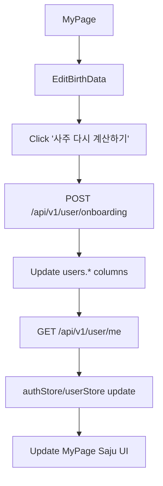

### 마이페이지 사주 재계산 기능 계획

#### 1. 정책/스펙 고정

- **사주 수정 허용 범위**
  - v1에서는 **언제든지 사용자가 직접 생년월일·시간·성별·달력 타입을 수정하고, 사주를 재계산할 수 있는 구조**로 구현한다.
  - 추후 제한(횟수 제한, 관리자 승인 등)이 필요하면 백엔드에 별도 정책/필드를 추가하는 것으로 확장 가능하게 둔다.
- **API 재사용 전략**
  - 백엔드의 `POST /api/v1/user/onboarding`를 **최초 온보딩 + 사주 재계산 모두를 담당하는 단일 엔드포인트**로 사용한다.
  - 프론트는 온보딩 페이지와 마이페이지 양쪽에서 동일 DTO(`OnboardingRequest`)로 이 엔드포인트를 호출한다.
  - 이 동작을 문서에도 명확히 적어두기 위해, `docs/FULL_SPECIFICATION.md` 5.2 사용자 API와 `docs/BACKEND_DEVELOPMENT_PLAN.md` Phase 2에 "재온보딩(사주 재계산) 허용" 문구를 추가하는 것을 후속 작업으로 남긴다.

#### 2. 데이터 흐름/아키텍처 정리

- **입력 필드 집합**
  - `birthDate`, `birthTime`, `gender`, `calendarType`, `nickname` (온보딩과 동일 세트)
- **백엔드 처리 결과**
  - `users.birth_date`, `birth_time`, `gender`, `calendar_type`를 새 값으로 저장.
  - `users.saju_element`, `zodiac_sign`를 다시 계산해 저장.
- **프론트 스토어 동기화**
  - `auth-store.checkAuth()` 혹은 `user-store.fetchProfile()`이 `/api/v1/user/me`를 다시 호출해 `User` 타입의 `birthDate/birthTime/gender/calendarType/sajuElement/zodiacSign`를 최신 상태로 맞춘다.

#### 3. 프론트 변경 상세 (파일 단위)

1. **타입/유틸 확인 및 보강**

   - `[src/types/user.ts]`:
     - 이미 추가된 `birthDate`, `birthTime`, `gender`, `calendarType`, `sajuElement`, `zodiacSign` 필드를 **온보딩/마이페이지 양쪽에서 공통으로 사용**하는 기준 타입으로 고정한다.
   - `[src/lib/utils.ts]`:
     - `hasCompletedOnboarding(user)`는 그대로 유지하되, 사주 재계산 후에도 동일 규칙(`birthDate && sajuElement`)으로 온보딩 완료 상태를 평가하게 한다.

2. **User API/스토어 재사용 전략 확인**

   - `[src/lib/api/user.ts]`:
     - `submitOnboarding(onboardingData: OnboardingRequest)`가 온보딩/재온보딩 공통 진입점이므로 **추가 엔드포인트를 만들지 않고 그대로 사용**한다.
   - `[src/stores/user-store.ts]`:
     - `fetchProfile()`이 `userApi.getProfile()` 호출을 통해 `profile: User`를 최신화하므로, 재계산 이후에도 이 액션을 호출하면 마이페이지 UI가 일관되게 갱신된다.

3. **마이페이지 UI를 사주 수정 가능 형태로 변경**

   - `[src/app/(main)/mypage/page.tsx]`:
     - 현재 읽기 전용으로 바꿔둔 `birthDate`, `birthTime` 입력을 **다시 수정 가능 입력 필드**로 되돌린다.
     - `gender`, `calendarType`에 대해서도 **조회/수정 가능 UI**를 추가한다.
       - 예: `select` 컴포넌트로 `MALE/FEMALE/OTHER`, `SOLAR/LUNAR/LUNAR_LEAP`를 선택.
     - 사주 관련 표시 영역에 현재처럼 `sajuElement`, `zodiacSign`을 보여주되, **해당 값이 재계산으로 변경될 수 있음을 안내하는 텍스트**를 추가한다.
     - 기존 `updateProfile`는 일반 필드(`nickname`, `isPublic`, `isRankingJoined`, `avatarUrl` 등)용으로 유지하고, 사주 입력값은 별도 로컬 상태로 관리해 `submitOnboarding` 호출에만 사용한다.

4. **"사주 다시 계산하기" 액션 추가 (프론트 로직)**

   - `[src/app/(main)/mypage/page.tsx]`에 다음 플로우를 갖는 버튼/핸들러 추가:
     - 로컬 상태에 `birthDate`, `birthTime`, `gender`, `calendarType`, `nickname`을 보관.
     - 버튼 클릭 시:

       1. 필수값(`birthDate`, `gender`, `calendarType`, `nickname`) 검증.
       2. `userApi.submitOnboarding({ nickname, birthDate, birthTime, gender, calendarType })` 호출.
       3. 성공하면 `authStore.checkAuth()` 또는 `userStore.fetchProfile()`을 호출해 프로필을 재로딩.
       4. 성공 토스트/알림: "사주 정보가 다시 계산되었습니다".
       5. 에러 시: 기존 온보딩 페이지와 동일 패턴으로 에러 메시지 출력.

5. **온보딩 페이지와 마이페이지 동작 통일성 유지**

   - `[src/app/onboarding/page.tsx]`:
     - 이미 `userApi.submitOnboarding` 호출 후 `checkAuth()`를 실행하도록 바꾼 상태이므로, 마이페이지와 **동일한 요청 DTO/응답 활용**을 유지한다.
     - 필요하다면, 마이페이지에서 재계산 직후에도 온보딩 결과 카드와 유사한 형태로 현재 사주 요약(오행/띠/운세)을 짧게 보여줄 수 있도록, 공통 사주 표시 컴포넌트로 분리하는 것도 후속 개선으로 남긴다.

#### 4. 정책/UX 레벨 보완 사항

- **사용자 안내/경고**
  - 마이페이지 사주 수정 영역 상단에 다음과 같은 안내문을 추가하는 것을 권장:
    - "사주 정보(생년월일/시간/성별/달력)는 AI 조언과 캐릭터 컨셉에 영향을 주며, 변경 시 전체 경험이 달라질 수 있습니다. 신중하게 수정해주세요."
  - 재계산 버튼 클릭 시 **확인 모달**을 띄우는 것도 옵션:
    - "정말로 사주를 다시 계산하시겠습니까?" → 확인 시에만 API 호출.
- **향후 제한 정책 여지 남기기**
  - 현재 버전에서는 프론트에서 추가 제한 없이 호출 허용.
  - 필요 시 백엔드에서 `onboarding_history` 테이블 또는 `users.onboarding_updated_at` 등을 도입해 호출 횟수나 최근 변경일 기반 제한을 둘 수 있도록 문서에 여지를 남긴다.

#### 5. 간단 테스트 플랜

- **시나리오 1: 최초 온보딩 후 마이페이지에서 사주 재계산**
  - 온보딩 완료 상태(대시보드 진입 가능)에서 `/mypage` 접속.
  - 생년월일을 다른 날짜로 변경 후 "사주 다시 계산하기" 클릭.
  - 기대 결과: 에러 없이 완료, `sajuElement`/`zodiacSign`이 변경된 값으로 표시, 새로고침 후에도 동일.
- **시나리오 2: 잘못된 입력**
  - 필수값 누락(`birthDate` 비움) 상태에서 버튼 클릭.
  - 기대 결과: 프론트에서 즉시 검증 에러 메시지 표시, API 호출 없음.
- **시나리오 3: 백엔드 오류**
  - 서버에서 400/500을 흘려보내는 상황(mock)에서 재계산 시도.
  - 기대 결과: 마이페이지 상단에 오류 메시지 표시, 기존 사주/생년월일 값은 유지.

#### 6. 후속 문서 작업 (선택, 별도 커밋)

- `docs/FULL_SPECIFICATION.md`:
  - 5.2 사용자 API `POST /api/v1/user/onboarding` 설명에 "마이페이지에서 사주 수정 시에도 동일 엔드포인트를 사용하여 재계산한다"는 문장을 추가.
- `docs/BACKEND_DEVELOPMENT_PLAN.md`:
  - Phase 2(User/Onboarding API)에서 `POST /user/onboarding`이 **idempotent 재온보딩(사주 재계산)**을 지원함을 명시.
- `docs/FRONTEND_DEVELOPMENT_PLAN.md`:
  - 마이페이지 섹션에 "사주 정보(생년월일/시간/성별/달력)를 수정하면 재계산 버튼으로 백엔드 온보딩 API를 다시 호출"하는 플로우를 반영.