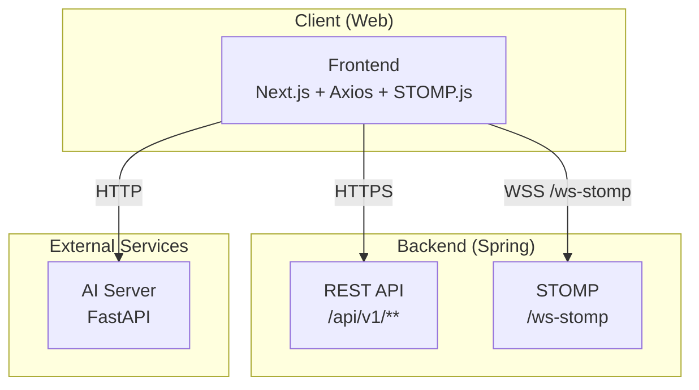
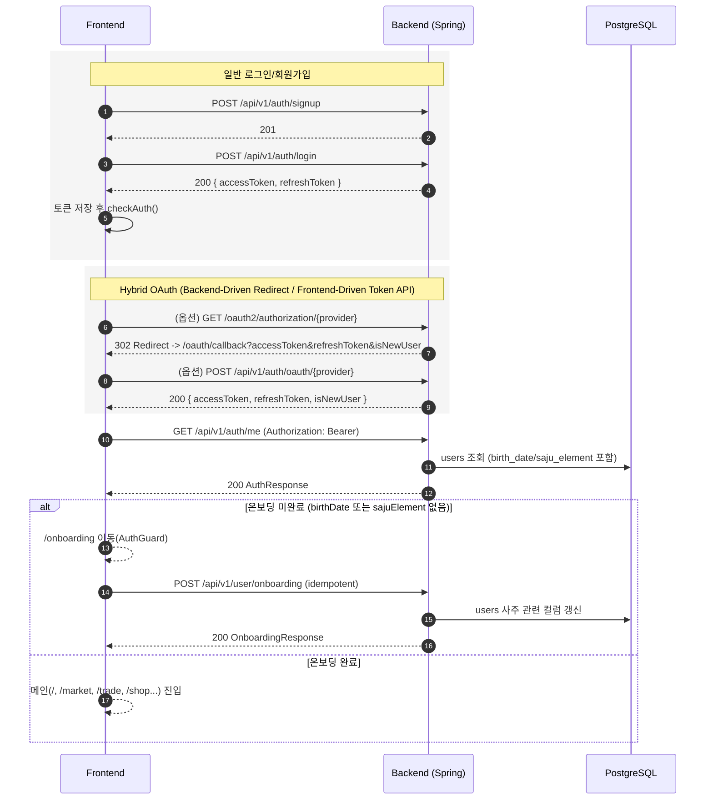
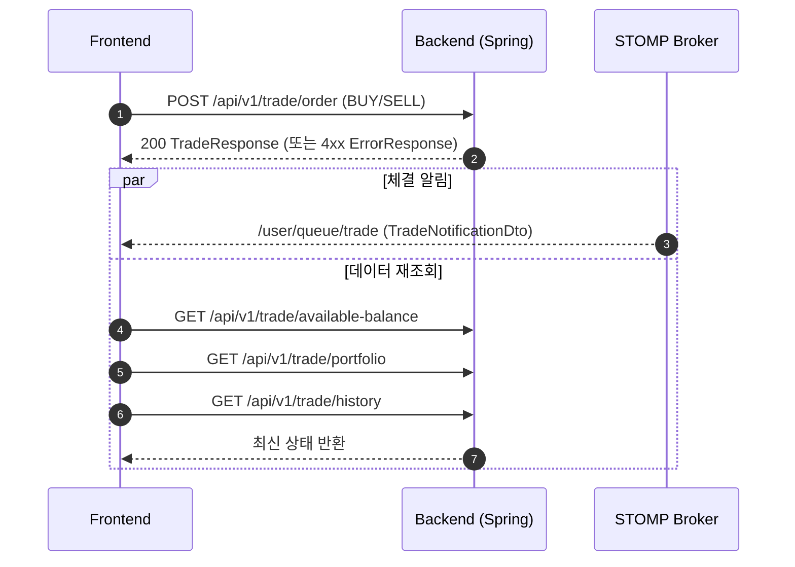
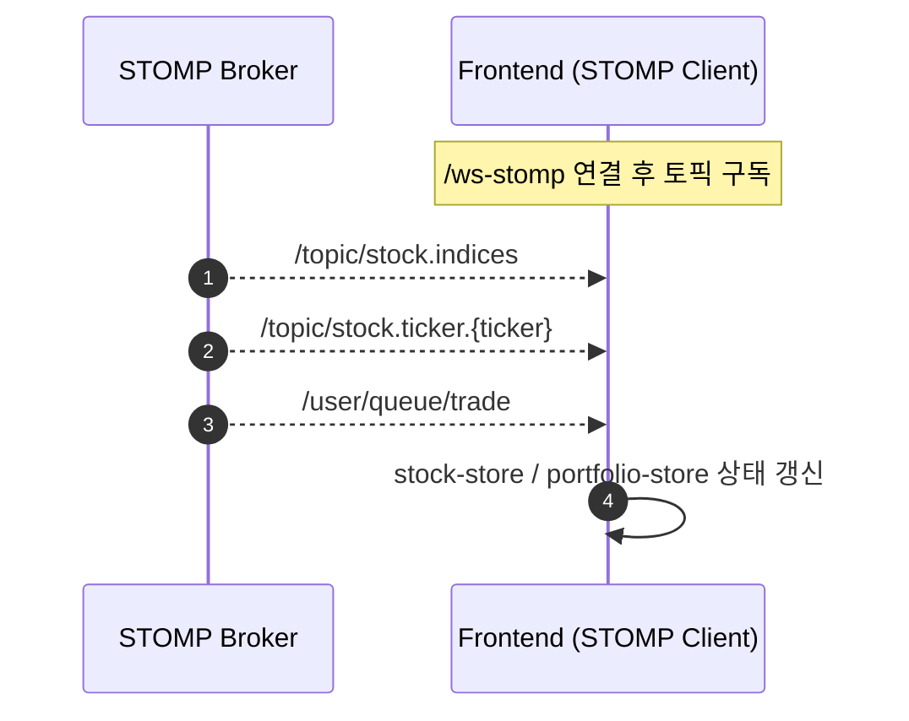
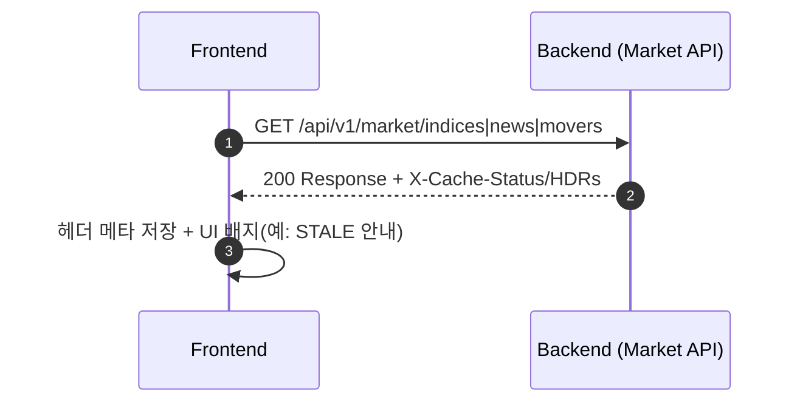
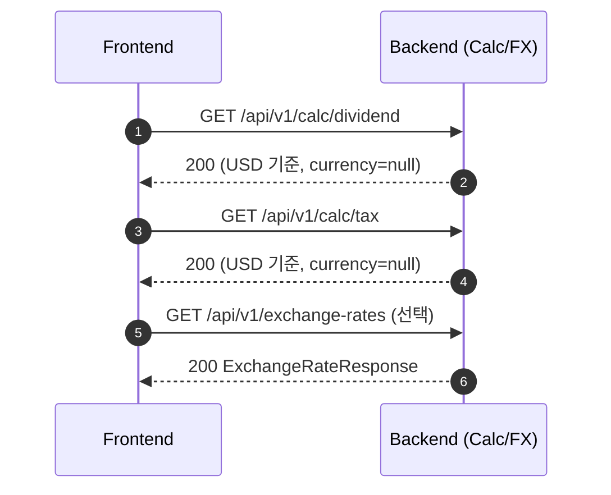

# MadCamp02 Frontend - 주술사 -

Finnhub 실시간 시세 + 모의투자(거래/포트폴리오) + 게이미피케이션(가챠/인벤토리/랭킹) + 사주(온보딩) + AI 도사 상담을 제공하는 **Next.js 기반 프론트엔드**
---

## 기술 스택

### Frontend Core

- **프레임워크**: Next.js 16 (App Router) + React 19
- **언어**: TypeScript 5.x
- **스타일링**: Tailwind CSS
- **UI**: Shadcn UI
- **상태 관리**: Zustand (`src/stores/*`)

### 네트워크 / 실시간 / 차트

- **REST**: Axios (`src/lib/api/*`)
- **실시간**: STOMP.js (`/ws-stomp`)
- **차트/시각화**: Lightweight Charts
- **캐싱 UX**: 백엔드 캐시 헤더(`X-Cache-Status`, `X-Cache-Age`, `X-Data-Freshness`) 파싱 및 UI 노출
- **AI 연동**: `src/lib/api/ai.ts` (FastAPI AI 서버 연동)

---

## 시스템 아키텍처



---

## 시퀀스 다이어그램 (핵심 플로우)

### 1) 인증/온보딩 (Hybrid Auth + 온보딩 강제)



### 2) 거래 실행 (주문 + 체결 알림 + 재조회)



### 3) 실시간 시세 (STOMP: Finnhub → 서버 브로드캐스트 → 프론트 수신)



### 4) Market API 캐시 헤더 처리 (HIT/MISS/STALE UI)



### 5) Calc/환율 (계산기)



---

## 페이지/라우트 개요

- **완료된 라우트**: `/`, `/market`, `/trade`, `/portfolio`, `/shop`, `/ranking`, `/oracle`, `/mypage`, `/login`, `/signup`, `/oauth/callback`, `/onboarding`, `/calculator`
- **정리 규칙**: `/gacha`는 `/shop`으로 리다이렉트

---

## 빠른 시작(로컬)

### 1) 설치

```bash
npm install
```

### 2) 환경 변수

`.env.local`에 백엔드 Base URL을 설정합니다.

```bash
NEXT_PUBLIC_API_URL=
```

### 3) 실행

```bash
npm run dev
```

---

## 주요 엔드포인트(요약)

### Auth / User

- `POST /api/v1/auth/signup`
- `POST /api/v1/auth/login`
- `POST /api/v1/auth/refresh`
- `GET /api/v1/auth/me`
- `POST /api/v1/auth/oauth/kakao`
- `POST /api/v1/auth/oauth/google`
- `POST /api/v1/user/onboarding` (온보딩/재온보딩 공용, idempotent)
- `GET /api/v1/user/me`
- `PUT /api/v1/user/me`
- `GET /api/v1/user/wallet`
- `GET /api/v1/user/watchlist`
- `POST /api/v1/user/watchlist`
- `DELETE /api/v1/user/watchlist/{ticker}`

### Market / Stock / Trade

- `GET /api/v1/market/indices`
- `GET /api/v1/market/news`
- `GET /api/v1/market/movers`
- `GET /api/v1/stock/search`
- `GET /api/v1/stock/quote/{ticker}`
- `GET /api/v1/stock/candles/{ticker}`
- `GET /api/v1/stock/orderbook/{ticker}`
- `GET /api/v1/trade/available-balance`
- `POST /api/v1/trade/order`
- `GET /api/v1/trade/portfolio`
- `GET /api/v1/trade/history`

### Game / Calc

- `GET /api/v1/game/items`
- `POST /api/v1/game/gacha`
- `GET /api/v1/game/inventory`
- `PUT /api/v1/game/equip/{itemId}`
- `GET /api/v1/game/ranking`
- `GET /api/v1/calc/dividend`
- `GET /api/v1/calc/tax`
- `GET /api/v1/exchange-rates`
- `GET /api/v1/exchange-rates/latest`

### Realtime (STOMP)

- **Endpoint**: `/ws-stomp`
- **Topics**
  - `/topic/stock.indices`
  - `/topic/stock.ticker.{ticker}`
  - `/user/queue/trade`
