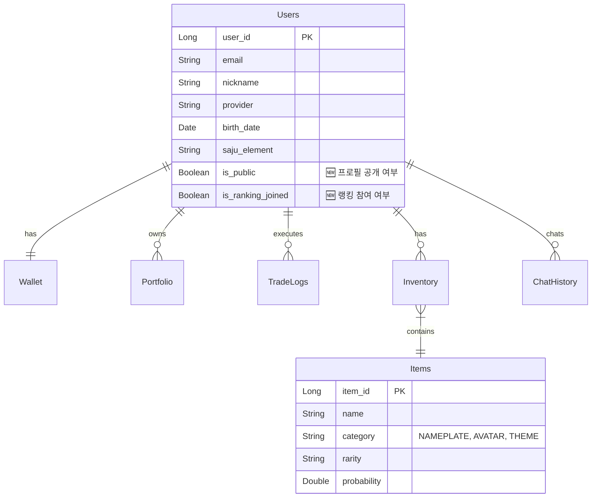

# ⚙️ MadCamp02: 백엔드 개발 계획서

**Ver 2.7.3 - Backend Development Blueprint (Spec-Driven Alignment)**

---

## 📝 변경 이력

| 버전 | 날짜 | 변경 내용 | 작성자 |
|------|------|----------|--------|
| 1.0 | 2026-01-15 | 초기 명세서 작성 | MadCamp02 |
| 2.0 | 2026-01-16 | Exception 구조 정리, ErrorResponse DTO 추가 | MadCamp02 |
| 2.1 | 2026-01-17 | 카카오 OAuth, 일반 회원가입/로그인 추가 | MadCamp02 |
| 2.2 | 2026-01-17 | OAuth2 백엔드 주도 방식으로 변경 | MadCamp02 |
| 2.3 | 2026-01-18 | 프론트엔드 구현 현황 반영 (Market, Shop, Trade 페이지 API 추가) | MadCamp02 |
| 2.4 | 2026-01-18 | 통합 명세서 및 프론트 계획 완전 동기화 | MadCamp02 |
| 2.5 | 2026-01-18 | 통합 명세서(FULL_SPECIFICATION)와 버전 동기화 및 최종 점검 | MadCamp02 |
| **2.6** | **2026-01-18** | **하이브리드 인증 방식(Frontend/Backend Driven) 명세 반영 및 구현 현황 점검** | **MadCamp02** |
| **2.7** | **2026-01-18** | **3개 문서 버전 동기화 및 엔드포인트/용어 문구 정리(프론트 연동 기준)** | **MadCamp02** |
| **2.7.1** | **2026-01-18** | **Phase 0: 응답 DTO(최소 필드) 규약을 FULL_SPEC에 고정 + STOMP(`/ws-stomp`) 설정/보안 예외 고정** | **MadCamp02** |
| **2.7.2** | **2026-01-18** | **테스트 경로 정규화(src/test/java) + CI에서 “실제 테스트 실행”을 위한 후속(CI/CD) 작업 항목 명시** | **MadCamp02** |
| **2.7.3** | **2026-01-18** | **Phase 1: `items.category` 레거시→목표 매핑 표 및 Unknown 값 마이그레이션 실패(raise) 정책 고정** | **MadCamp02** |

### Ver 2.6 주요 변경 사항

1.  **인증 아키텍처 현실화**: 실제 코드(`SecurityConfig`, `AuthController`)에 구현된 **하이브리드 인증(Hybrid Auth)** 방식을 명세에 반영. 백엔드 주도(Redirect)와 프론트엔드 주도(Token API) 방식을 모두 지원함.
2.  **구현 현황 추적**: 현재 코드베이스 상태와 명세서 간의 갭(Gap)을 분석하여 '구현 현황' 섹션 추가.

### Ver 2.7 주요 변경 사항

1.  **정합성 기준 고정**: `FULL_SPECIFICATION` 및 프론트/백엔드 개발 계획서(2.7)를 기준으로 API/실시간/인증 인터페이스를 고정하고, 구현을 그 기준에 맞춰 진행.
2.  **프론트 연동 우선순위 반영**: (1) Hybrid Auth Callback/토큰 저장 → (2) `lib/api` 모듈화 및 401 Refresh/Retry → (3) 페이지 실데이터 치환 → (4) STOMP/SSE 실시간 순으로 연동.
3.  **향후 실행 계획 추가**: `FRONTEND_DEVELOPMENT_PLAN`, `FULL_SPECIFICATION`을 기준으로 백엔드 구현 순서/산출물을 문서 하단에 명시.

### Ver 2.7.1 주요 변경 사항

1.  **응답 DTO 스키마 고정**: 프론트 연동을 위해 Market/Portfolio/Inventory/Ranking의 “최소 필드”를 `docs/FULL_SPECIFICATION.md`의 **5.0 공통 응답 규약**으로 고정.
2.  **STOMP 엔드포인트 고정**: 문서/코드 정합성 기준으로 `/ws-stomp`를 고정하고, 보안 예외도 동일하게 정렬.

### Ver 2.7.2 주요 변경 사항

1.  **테스트 경로 정규화(정석)**: 테스트 소스를 `src/test/java` 표준 경로로 통일하여 Gradle/CI에서 테스트 탐지가 안정적으로 동작하도록 정리.
2.  **CI/CD 후속 작업 명시**: 통합 테스트를 “항상 통과”시키기 위한 전략(서비스 컨테이너 vs 테스트 프로파일)을 문서화하고 Phase로 분리.

### Ver 2.7.3 주요 변경 사항

1.  **`items.category` 레거시 정합화 정책 고정**: Flyway V3에서의 레거시→목표 매핑 표를 명시하고, Unknown 값 발견 시 마이그레이션을 실패(raise)시키는 Fail Fast 정책을 고정.

---

## 📋 목차

1. [시스템 개요](#1-시스템-개요)
2. [아키텍처 설계](#2-아키텍처-설계)
3. [기술 스택](#3-기술-스택)
4. [프로젝트 구조](#4-프로젝트-구조)
5. [데이터베이스 설계](#5-데이터베이스-설계)
6. [API 상세 설계](#6-api-상세-설계)
7. [인증 및 보안](#7-인증-및-보안)
8. [실시간 통신](#8-실시간-통신)
9. [외부 API 연동](#9-외부-api-연동)
10. [비즈니스 로직](#10-비즈니스-로직)
11. [구현 현황 (Status)](#11-구현-현황-status)
12. [향후 실행 계획 (Next Plan)](#12-향후-실행-계획-next-plan)

---

## 1. 시스템 개요

### 1.1 백엔드 역할

MadCamp02 백엔드는 다음 핵심 기능을 담당합니다:

1. **사용자 관리**: OAuth2 인증(Hybrid), JWT 토큰 발급, 프로필 및 사주 데이터 관리
2. **모의투자 엔진**: 실시간 호가/체결 처리, 포트폴리오 평가, 매수/매도 트랜잭션 관리
3. **실시간 데이터**: Finnhub WebSocket → Redis → 클라이언트 중계 (주가, 호가)
4. **게이미피케이션**: 가챠(확률형 아이템), 아이템 인벤토리, 랭킹 산정
5. **AI 상담**: 사주 기반 투자 조언 (FastAPI 연동)

---

## 2. 아키텍처 설계

### 2.1 레이어드 아키텍처

```
┌─────────────────────────────────────────────────────────────────┐
│                     PRESENTATION LAYER                           │
│  ┌─────────────────────────────────────────────────────────────┐ │
│  │  Controllers (REST API)                                     │ │
│  │  ├── AuthController, UserController, MarketController       │ │
│  │  ├── TradeController, StockController, GameController       │ │
│  │  └── ChatController, NotificationController, CalcController │ │
│  └─────────────────────────────────────────────────────────────┘ │
│  ┌─────────────────────────────────────────────────────────────┐ │
│  │  WebSocket Handlers (STOMP)                                 │ │
│  │  ├── StockPriceHandler (주가/호가)                          │ │
│  │  └── TradeNotificationHandler (체결 알림)                   │ │
│  └─────────────────────────────────────────────────────────────┘ │
└─────────────────────────────────────────────────────────────────┘
                              │
                              ▼
┌─────────────────────────────────────────────────────────────────┐
│                      SERVICE LAYER                               │
│  ├── AuthService, UserService, MarketService                     │
│  ├── TradeService, StockService, PortfolioService                │
│  ├── GachaService, InventoryService, RankingService              │
│  └── ChatService, SajuService, DividendService                   │
└─────────────────────────────────────────────────────────────────┘
```

---

## 3. 기술 스택

### 3.1 Core Server (Spring Boot)

| 기술 | 버전 | 용도 |
|------|------|------|
| Java | 21 LTS | 언어 |
| Spring Boot | 3.4.x | 프레임워크 |
| Spring Security | 6.x | 인증/인가 (OAuth2 Client) |
| Spring Data JPA | 3.x | ORM |
| Spring WebSocket | 6.x | 실시간 통신 (STOMP) |
| SpringDoc OpenAPI | 2.8.x | Swagger/OpenAPI 문서 |

### 3.2 AI Server (FastAPI)

| 기술 | 버전 | 용도 |
|------|------|------|
| Python | 3.11+ | 언어 |
| FastAPI | 0.100+ | API 프레임워크 |
| SSE | - | 스트리밍 응답 (Server-Sent Events) |

---

## 4. 프로젝트 구조 (패키지)

```
📦 src/main/java/com/madcamp02
 ┣ 📂 config            # Security, Swagger, WebSocket, Redis 설정
 ┣ 📂 controller        # REST API 컨트롤러
 ┣ 📂 domain            # Entity 및 Repository
 ┃ ┣ 📂 user
 ┃ ┣ 📂 stock
 ┃ ┣ 📂 trade
 ┃ ┣ 📂 item
 ┃ ┗ 📂 chat
 ┣ 📂 dto               # Request/Response DTO
 ┣ 📂 service           # 비즈니스 로직
 ┣ 📂 security          # JWT, OAuth2 핸들러
 ┣ 📂 exception         # Global Exception Handler
 ┗ 📂 external          # Finnhub, AI Server 연동 클라이언트
```

---

## 5. 데이터베이스 설계

### 5.1 ERD



### 5.2 주요 테이블 변경사항

1.  **Users 테이블**
    *   `is_public` (BOOLEAN, Default TRUE): 마이페이지 설정 반영
    *   `is_ranking_joined` (BOOLEAN, Default TRUE): 랭킹 참여 여부

2.  **Items 테이블**
    *   `category` 컬럼 ENUM: `NAMEPLATE` (이름표/테두리), `AVATAR` (아바타 장식), `THEME` (앱 테마)
    *   프론트엔드 `Shop` 페이지 탭 구성과 정확히 일치

---

## 6. API 상세 설계

### 6.1 Market API (신규)

프론트엔드 `/market` 페이지 지원

| 메서드 | 경로 | 설명 |
|--------|------|------|
| GET | `/api/v1/market/indices` | 주요 지수 (KOSPI, NASDAQ 등) 조회 |
| GET | `/api/v1/market/news` | 최신 시장 뉴스 조회 |
| GET | `/api/v1/market/movers` | 급등/급락/거래량 상위 종목 조회 |

### 6.2 Game/Shop API (확장)

프론트엔드 `/shop`, `/mypage` 페이지 지원

| 메서드 | 경로 | 설명 |
|--------|------|------|
| GET | `/api/v1/game/items` | 아이템 목록 조회 (Query Param: `category` 지원) |
| POST | `/api/v1/game/gacha` | 가챠 뽑기 (코인 차감 및 인벤토리 지급) |
| GET | `/api/v1/game/inventory` | 내 인벤토리 조회 |
| PUT | `/api/v1/game/equip/{itemId}` | 아이템 장착/해제 |

### 6.3 Trade API (확장)

프론트엔드 `/trade` 및 `/portfolio` 페이지 지원

| 메서드 | 경로 | 설명 |
|--------|------|------|
| GET | `/api/v1/stock/orderbook/{ticker}` | 호가(Orderbook) 데이터 조회 |
| GET | `/api/v1/trade/available-balance` | 현재 매수 가능 금액 조회 |
| GET | `/api/v1/trade/portfolio` | 상세 포트폴리오 (평가손익 포함) |

### 6.4 Calculation API (신규) 🆕

프론트엔드 `/calculator` 페이지 지원

| 메서드 | 경로 | 설명 |
|--------|------|------|
| GET | `/api/v1/calc/dividend` | 보유 종목 기반 예상 배당금 및 세금 계산 |
| GET | `/api/v1/calc/tax` | 실현 수익 기반 예상 양도소득세 계산 |

### 6.5 Auth API (기존 유지)

| 메서드 | 경로 | 설명 |
|--------|------|------|
| POST | `/api/v1/auth/signup` | 일반 회원가입 |
| POST | `/api/v1/auth/login` | 일반 로그인 |
| GET | `/api/v1/auth/me` | 현재 사용자 정보 (사주 정보 포함) |

---

## 7. 인증 및 보안

### 7.1 Hybrid OAuth2 Architecture

MadCamp02는 다양한 클라이언트 환경(Web, Mobile, External)을 지원하기 위해 **두 가지 인증 방식을 모두 지원**합니다.

#### A. Backend-Driven (표준 웹 방식)
*   **흐름**: `GET /oauth2/authorization/kakao` → Provider Login → Redirect to Backend → Redirect to Frontend with Token.
*   **장점**: 보안성이 높음, 클라이언트 구현 간단.
*   **구현**: `SecurityConfig`의 `oauth2Login()` 설정 및 `OAuth2SuccessHandler`.

#### B. Frontend-Driven (모바일/SPA 친화적)
*   **흐름**: Frontend에서 Provider SDK로 토큰 획득 → `POST /api/v1/auth/oauth/kakao` (Body: accessToken) → Backend 검증 및 JWT 발급.
*   **장점**: 모바일 네이티브 SDK 활용 용이, 유연한 UI 제어.
*   **구현**: `AuthController`의 `kakaoLogin`, `googleLogin` 엔드포인트.

---

## 8. 실시간 통신 (WebSocket)

### 8.1 토픽 설계

*   **Endpoint**: `/ws-stomp` *(문서 정합성 기준, 프론트 연동 시 동일 엔드포인트 사용)*
*   `/topic/stock.indices`: 시장 지수 업데이트 (10초 주기)
*   `/topic/stock.ticker.{ticker}`: 개별 종목 체결가/호가 (실시간)
*   `/user/queue/trade`: 사용자 개인 주문 체결 알림

---

## 9. 외부 API 연동

### 9.1 Finnhub (주식 데이터)
*   WebSocket으로 실시간 미국 주식 데이터 수신
*   Redis에 최신가 캐싱 (`stock:price:{ticker}`)

### 9.2 FastAPI (AI 서버)
*   **Endpoint**: `POST /chat/ask` (SSE Streaming)
    *   사용자의 포트폴리오 및 사주 정보를 컨텍스트로 포함하여 LLM에 질의
*   SSE(Server-Sent Events)를 통해 스트리밍 응답 제공

---

## 10. 비즈니스 로직 (핵심)

### 10.1 가챠(Gacha) 로직
1.  사용자 지갑에서 코인 차감 (`WalletService`)
2.  확률 테이블(`Items`의 `probability`)에 따라 아이템 추첨 (`RandomUtils`)
3.  인벤토리에 아이템 추가 (중복 시 대체 보상 또는 레벨업 고려)
4.  결과 DTO 반환

### 10.2 사주 분석 로직 (`SajuCalculator`)
1.  생년월일 기반 천간(Heavenly Stem) 지지(Earthly Branch) 계산
2.  오행(Wood, Fire, Earth, Metal, Water) 도출
3.  오행별 투자 성향 매핑 (DB 또는 Enum 관리)

---

## 11. 구현 현황 (Status)

**Current Date:** 2026-01-18

| 모듈 | 진행률 | 상태 | 비고 |
|------|--------|------|------|
| **Auth** | 100% | ✅ Complete | Hybrid 인증 인터페이스(Backend/Frontend Driven) 확정. 프론트 `/oauth/callback` 및 토큰 저장/갱신 연동은 Phase 1에서 진행. |
| **User** | 80% | ⚠️ Update Req | 기본 엔티티 존재하나 `is_public` 등 신규 필드 누락됨. |
| **Market** | 0% | ⬜ Pending | Controller/Service 미구현. |
| **Trade** | 10% | 🚧 In Progress | 엔티티(`TradeLog`) 존재, 로직 미구현. |
| **Game** | 20% | ⚠️ Update Req | `Item` 엔티티 존재하나 Category Enum(`NAMEPLATE` 등) 업데이트 필요. |
| **AI** | 0% | ⬜ Pending | FastAPI 연동 미구현. |

---

## 12. 향후 실행 계획 (Next Plan)

**정합성 기준(Single Source of Truth)**  
`docs/FULL_SPECIFICATION.md` + `docs/FRONTEND_DEVELOPMENT_PLAN.md` (둘 다 v2.7.3) 기준으로, 백엔드 구현을 아래 순서로 진행합니다.

### 12.1 Phase 0: 인터페이스 고정(프론트 연동 선행)

- **Auth 연동 고정**: `POST /api/v1/auth/*` + `GET /oauth2/authorization/{provider}` + `/oauth/callback` 리다이렉트 파라미터 규약 유지
- **실시간(STOMP) 엔드포인트 정합성**: 프론트 문서 기준 `Endpoint: /ws-stomp`로 고정하고, 백엔드 보안 예외/설정도 동일하게 맞춤
- **응답 DTO 확정**: 프론트 페이지가 필요한 최소 필드(지수/뉴스/무버/포트폴리오/인벤토리/랭킹)를 먼저 확정한 뒤 구현  
  - **단일 진실(Single Source of Truth)**: `docs/FULL_SPECIFICATION.md`의 `5.0 공통 응답 규약 (Phase 0: Interface Freeze)` 섹션을 기준으로 Response 스키마를 고정

### 12.2 Phase 1: DB/도메인 2.7(2.6 목표 포함) 정합성 (Blocking)

- **Flyway V2**: `users.is_public`, `users.is_ranking_joined` 컬럼 추가(+ 기본값 TRUE)
- **Flyway V3**: `items.category`를 `NAMEPLATE/AVATAR/THEME` 체계로 전환/매핑(기존 데이터 대응 포함)
- **Entity 정합화**:
  - `User`에 공개/랭킹참여 필드 및 업데이트 메서드 추가
  - `Item.Category` Enum을 목표 체계로 변경(레거시 매핑 전략 문서화)

#### 12.2.1 `items.category` 레거시→목표 매핑 정책 (Single Source of Truth)

아래 매핑은 **Flyway V3(데이터 마이그레이션)** 및 **백엔드 도메인 Enum**의 단일 진실입니다.

| Legacy Category (V1) | Target Category (Phase 1+) | 비고 |
|---|---|---|
| `COSTUME` | `AVATAR` | 아바타 꾸미기 아이템(레거시) |
| `ACCESSORY` | `AVATAR` | 아바타 꾸미기 아이템(레거시) |
| `AURA` | `AVATAR` | 아바타 꾸미기 아이템(레거시) |
| `BACKGROUND` | `THEME` | 화면/배경 계열(레거시) |

> `NAMEPLATE`는 레거시에 직접 대응 값이 없으므로, 신규 데이터부터 `NAMEPLATE`로 생성/저장합니다.

#### 12.2.2 Unknown 처리 정책 (Fail Fast)

- **Flyway V3는 “조용한 통과”를 금지**합니다.
- 마이그레이션 수행 후 `items.category`에 `NAMEPLATE | AVATAR | THEME` 외 값이 하나라도 남아있으면 **즉시 실패(raise)**하여 배포를 차단합니다.
- (권장) 마이그레이션에서 `CHECK (category IN ('NAMEPLATE','AVATAR','THEME'))` 제약을 추가해 **재발을 원천 차단**합니다.

### 12.3 Phase 2: User/Onboarding API (프론트 Phase 1~2 연동 핵심)

- **구현 대상**: `UserController`, `UserService`
- **엔드포인트**:
  - `GET /api/v1/user/me`
  - `PUT /api/v1/user/me` (nickname, is_public, is_ranking_joined 등)
  - `POST /api/v1/user/onboarding`
  - `GET /api/v1/user/wallet`

### 12.4 Phase 3: Market/Stock API (프론트 `/market`, `/trade` 실데이터 치환)

- **구현 대상**: `MarketController/Service`, `StockController/Service` (+ Finnhub REST 연동)
- **엔드포인트**:
  - `GET /api/v1/market/indices`
  - `GET /api/v1/market/news`
  - `GET /api/v1/market/movers`
  - `GET /api/v1/stock/search`
  - `GET /api/v1/stock/quote/{ticker}`
  - `GET /api/v1/stock/candles/{ticker}`
- **캐시 전략(권장)**: indices/news/movers는 Redis TTL 기반 캐시로 비용/지연 최소화

### 12.5 Phase 4: Trade/Portfolio Engine (프론트 `/trade`, `/portfolio` 완성)

- **구현 대상**: `TradeController/Service`, `PortfolioService`, `WalletService`
- **엔드포인트**:
  - `GET /api/v1/trade/available-balance`
  - `POST /api/v1/trade/order`
  - `GET /api/v1/trade/portfolio`
  - `GET /api/v1/trade/history`
- **무결성**: 동시 요청 대비 트랜잭션/락 전략을 명확히 하고(명세서의 흐름 그대로) 테스트로 고정

### 12.6 Phase 5: Shop/Game/Ranking (프론트 `/shop`, `/mypage`, `/ranking`)

- **구현 대상**: `GameController`, `GachaService`, `InventoryService`, `RankingService`
- **엔드포인트**:
  - `GET /api/v1/game/items` (Query: `category`)
  - `POST /api/v1/game/gacha`
  - `GET /api/v1/game/inventory`
  - `PUT /api/v1/game/equip/{itemId}`
  - `GET /api/v1/game/ranking` (랭킹 참여 토글 반영)

### 12.7 Phase 6: 실시간(STOMP) + 알림(선택/후순위)

- **구현 대상**: `WebSocketConfig`, Stock broadcast/Trade notification handler
- **토픽(프론트 문서 기준)**:
  - `/topic/stock.indices`
  - `/topic/stock.ticker.{ticker}`
  - `/user/queue/trade`

### 12.8 Phase 7: AI(SSE) 연동 (프론트 `/oracle`)

- **구현 대상**: `ChatController`(SSE), `ChatHistory` 저장, AI 서버 프록시/클라이언트
- **엔드포인트**: `POST /api/v1/chat/ask` (SSE 스트리밍)

### 12.9 Phase 8: CI/CD + 테스트 전략 (후속, 품질 게이트 고정)

현재 CI의 `Build Test`는 `./gradlew clean build`를 수행하므로, **테스트가 실제로 실행**됩니다.  
다만 `@SpringBootTest` 기반 통합 테스트는 Postgres/Redis/Flyway 등 외부 인프라 의존이 있어, CI에서 “항상 통과”시키려면 아래 중 하나를 선택해 고정해야 합니다.

- **Option A (Service 붙이기 / CI 친화)**: GitHub Actions 워크플로우에 Postgres/Redis 서비스를 추가하고, 테스트에서 해당 서비스로 연결
  - 장점: 운영과 가장 유사한 환경에서 검증
  - 단점: CI 시간 증가, 컨테이너 초기화/헬스체크 관리 필요
- **Option B (테스트 프로파일/내장 대체 / 빠른 피드백)**: `application-test.yml`로 H2/embedded 또는 Testcontainers 기반 프로파일을 도입해 외부 의존 없이 테스트 실행
  - 장점: 빠르고 안정적, 로컬/CI 일관성 높음
  - 단점: 운영(Postgres/Redis)과 차이가 생길 수 있어 일부 통합 버그를 놓칠 수 있음

> 위 2가지는 “CI/CD 구성 단계”에서 선택/고정하고, 선택 결과를 `docs`에 반영하여 팀 합의(단일 진실)로 유지합니다.

---

**문서 버전:** 2.7.3 (Spec-Driven Alignment)  
**최종 수정일:** 2026-01-18
