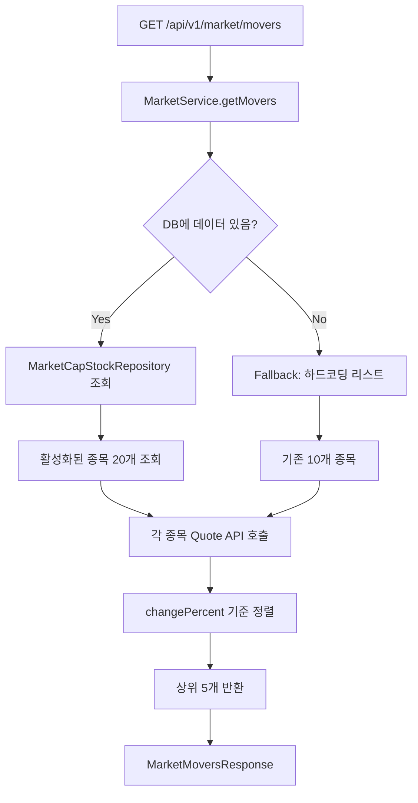

# 🎨 MadCamp02: 프론트엔드 개발 계획서

**Ver 2.7.16 - Frontend Development Blueprint (Spec-Driven Alignment)**

---

## 📝 변경 이력

| 버전      | 날짜           | 변경 내용                                                                                                               | 작성자        |
| --------- | -------------- | ----------------------------------------------------------------------------------------------------------------------- | ------------- |
| 1.0       | 2026-01-15     | 초기 명세서 작성                                                                                                        | MadCamp02     |
| 1.4       | 2026-01-17     | 구현 상태 1차 분석                                                                                                      | MadCamp02     |
| 1.5       | 2026-01-18     | 실제 구현 현황(Market, Shop, Trade 등) 반영                                                                             | MadCamp02     |
| 2.5       | 2026-01-18     | 통합 명세서(FULL_SPECIFICATION) 및 백엔드 명세와 완전 동기화                                                            | MadCamp02     |
| **2.6**   | **2026-01-18** | **하이브리드 인증(Hybrid Auth) 지원 명시**                                                                              | **MadCamp02** |
| **2.7**   | **2026-01-18** | **문서 기준 정합성(라우팅/스토어/연동) 로드맵 확정 및 엔드포인트/용어 문구 정리**                                       | **MadCamp02** |
| **2.7.1** | **2026-01-18** | **Phase 0: Response DTO 공통 규약(items 패턴/예시 JSON) 동기화 + STOMP(`/ws-stomp`) 정합성 고정**                       | **MadCamp02** |
| **2.7.2** | **2026-01-18** | **백엔드 CI에서 “실제 테스트 실행”이 가능하도록 테스트 경로 정규화 반영(후속 CI/CD 전략은 백엔드 계획서 참고)**         | **MadCamp02** |
| **2.7.3** | **2026-01-18** | **Phase 1: 상점/인벤토리 카테고리 규약(`NAMEPLATE/AVATAR/THEME`) 및 레거시 매핑/Unknown fail 정책(백엔드 Flyway) 명시** | **MadCamp02** |
| **2.7.6** | **2026-01-19** | **데이터 전략 반영: Historical Data(캔들) API 제한/에러 처리, WebSocket 구독 관리 전략, Quota 초과 시 동작 명시**     | **MadCamp02** |
| **2.7.7** | **2026-01-19** | **EODHD 무료 구독 제한(최근 1년) 주의사항 추가, 외부 API 확장 대응(Phase 4) 추가** | **MadCamp02** |
| **2.7.8** | **2026-01-19** | **지수 조회를 ETF로 변경 (Finnhub Quote API는 지수 심볼 미지원) - SPY, QQQ, DIA 사용** | **MadCamp02** |
| **2.7.9** | **2026-01-19** | **Phase 4: Trade/Portfolio Engine 완전 구현 및 문서 통합 (트랜잭션/락 전략, 다이어그램 포함)** | **MadCamp02** |
| **2.7.10** | **2026-01-19** | **Phase 5 백엔드 구현 완료 연동 안내(Shop/Gacha/Inventory/Ranking)** | **MadCamp02** |
| **2.7.11** | **2026-01-19** | **프론트 2.7.11 스냅샷 + Phase 5 완료 기반 “Phase 5.5: 프론트 연동·DB 제약 보강” 체크리스트 고정(Shop/Gacha/Inventory/Ranking 실데이터 전환, `{items:[]}`·카테고리/ETF/STOMP 정합성 재확인)** | **MadCamp02** |
| **2.7.12** | **2026-01-19** | **백엔드 Phase 4~6 구현 기준 Trade/Portfolio/Game/Realtime(WebSocket) DTO·에러 처리·토픽/endpoint 문구를 FULL_SPEC 및 BACKEND 계획서와 정합하게 보정** | **MadCamp02** |
| **2.7.13** | **2026-01-19** | **Phase 3.6: 백엔드 Redis 캐싱 확장 및 프론트엔드 이중 캐싱 전략 수립 (X-Cache-Status 헤더 처리)** | **MadCamp02** |
| **2.7.15** | **2026-01-20** | **실 구현 현황 최신화: 모든 주요 라우트/스토어가 실제 REST API 및 `/ws-stomp` 클라이언트와 연결됨을 반영, 온보딩 필드·OAuth 콜백·캐시 헤더 처리 정합성 수정** | **MadCamp02** |
| **2.7.16** | **2026-01-20** | **Kakao 동의 스코프를 `profile_nickname` 단일로 축소하고, 이메일은 백엔드가 임의 생성하도록 가이드. OAuth 콜백에서 `isNewUser`면 `/onboarding`으로 즉시 리다이렉트하도록 최초 로그인 플로우 명시(구글/카카오 공통).** | **MadCamp02** |

### Ver 2.6 주요 변경 사항

1.  **인증 선택지 확장**: 백엔드 API가 **하이브리드 인증**을 지원함에 따라, 프론트엔드 구현 시 상황(Web vs App)에 맞는 방식을 선택할 수 있도록 가이드 추가.

### Ver 2.7 주요 변경 사항

1.  **정합성 기준(Single Source of Truth) 고정**: `docs/FULL_SPECIFICATION.md` + 본 문서(Ver 2.7.11)를 기준으로 **코드를 문서에 맞춰 끌어올리는 전략**을 명시.
2.  **정합성 우선순위 확정**: (1) 라우트/폴더 단일화 → (2) Hybrid Auth → (3) `lib/api/*.ts` 모듈화 → (4) 페이지 실데이터 치환 → (5) WebSocket/SSE 순으로 단계화.
3.  **현 코드 불일치 항목을 작업 항목으로 승격**: `/signup`, `/oauth/callback`, `/calculator` 추가 및 `store/` vs `stores/` 단일화 등.

### Ver 2.7.1 주요 변경 사항

1.  **Response DTO 규약 고정**: 리스트 응답은 `{ items: [...] }` 패턴을 사용하고, Market/Portfolio/Inventory/Ranking의 최소 필드를 `docs/FULL_SPECIFICATION.md`(5.0) 기준으로 고정.
2.  **실시간(STOMP) 정합성 고정**: Endpoint를 `/ws-stomp`로 고정(토픽은 `/topic/*`, 개인 큐는 `/user/queue/*`).

### Ver 2.7.2 주요 변경 사항

1.  **CI 품질 게이트(후속) 인지**: 백엔드에서 테스트가 실제 실행되는 구조로 정리됨. CI/CD 전략(서비스 컨테이너 vs 테스트 프로파일)은 `docs/BACKEND_DEVELOPMENT_PLAN.md`의 Phase 8을 단일 진실로 참조.

### Ver 2.7.3 주요 변경 사항

1.  **상점/인벤토리 카테고리 규약 고정**: 프론트에서 사용하는 아이템 카테고리를 `NAMEPLATE | AVATAR | THEME`로 고정하고, 레거시 값은 백엔드 Flyway V3에서 정리되며 Unknown 값은 마이그레이션 실패(raise)로 차단됨을 명시.

### Ver 2.7.4 주요 변경 사항

1.  **온보딩 UI 확장**: Phase 2에서 정밀 사주 계산을 위해 성별(`gender`: MALE/FEMALE/OTHER), 양력/음력 구분(`calendarType`: SOLAR/LUNAR/LUNAR_LEAP), 생년월일시(`birthTime`: HH:mm, 선택, 기본값 00:00:00) 입력 필드를 추가해야 함.
2.  **온보딩 요청 DTO 확장**: `POST /api/v1/user/onboarding` 요청 Body에 `gender`, `calendarType`, `birthTime` 필드 추가 (기존 `birthDate`는 유지).

### Ver 2.7.5 주요 변경 사항

1.  **4주(四柱) 완전 구현**: 백엔드에서 연주/월주/일주/시주 모두 계산하여 정밀 사주 산출. 프론트는 추가 작업 불필요.
2.  **한국천문연구원 API 연동**: 백엔드에서 자동으로 양력↔음력 변환 처리하므로 프론트는 음력 입력만 전달하면 됨.
3.  **시간 기본값 변경**: 생년월일시 모를 경우 기본값이 `12:00:00`에서 `00:00:00`으로 변경됨.

### Ver 2.7.6 주요 변경 사항

1.  **데이터 전략 반영**: `docs/DATA_STRATEGY_PLAN.md` 기반으로 Historical Data(캔들) API 제한 및 에러 처리 명시.
2.  **Historical Data API 동작**: EODHD + DB 캐싱 기반. Quota 초과 시 기존 데이터(Stale) 반환 또는 429 에러 처리.
3.  **WebSocket 구독 관리**: 백엔드 LRU 기반 동적 구독 관리 전략 명시. 프론트는 페이지 이탈 시 명시적 구독 해제 권장.
4.  **에러 처리 가이드**: `429 QUOTA_EXCEEDED` 에러 시 사용자 안내 메시지 표시, `X-Data-Status: Stale` 헤더 감지 시 UI 표시.

---

## 📋 목차

1. [시스템 개요](#1-시스템-개요)
2. [아키텍처 설계](#2-아키텍처-설계)
3. [기술 스택](#3-기술-스택)
4. [프로젝트 구조](#4-프로젝트-구조)
5. [페이지별 상세 명세](#5-페이지별-상세-명세)
6. [상태 관리 (State Management)](#6-상태-관리-state-management)
7. [API 및 네트워크 계층](#7-api-및-네트워크-계층)
8. [개발 로드맵](#8-개발-로드맵)

---

## 1. 시스템 개요

### 1.1 프론트엔드 역할

MadCamp02 프론트엔드는 사용자에게 **직관적인 모의투자 경험**과 **몰입감 있는 게이미피케이션(RPG) 요소**를 제공하는 인터페이스입니다.

1.  **투자 대시보드**: 실시간 주가 차트, 호가창, 포트폴리오 현황 시각화.
2.  **RPG 요소**: 사주(Saju) 기반 캐릭터, 가챠(뽑기) 애니메이션, 아이템 장착 UI.
3.  **실시간 상호작용**: WebSocket을 통한 주가 업데이트, SSE를 통한 AI 도사 채팅.
4.  **반응형 UX**: 데스크탑(Desktop) 중심이나 모바일 환경에서도 원활한 사용성 보장.

---

## 2. 아키텍처 설계

### 2.1 클라이언트 아키텍처

Next.js App Router 기반의 서버 컴포넌트(RSC)와 클라이언트 컴포넌트의 적절한 조화를 지향합니다.

```
┌─────────────────────────────────────────────────────────────────┐
│                        VIEW LAYER (React)                       │
│  ┌─────────────────────────────────────────────────────────────┐ │
│  │  Pages (App Router)                                         │ │
│  │  ├── Layouts (Sidebar, Header, AuthGuard)                   │ │
│  │  └── Client Components (Interactive Widgets)                │ │
│  └─────────────────────────────────────────────────────────────┘ │
└─────────────────────────────────────────────────────────────────┘
                              │
                              ▼
┌─────────────────────────────────────────────────────────────────┐
│                      STATE MANAGEMENT                            │
│  ┌─────────────────────────────────────────────────────────────┐ │
│  │  Zustand Stores                                             │ │
│  │  ├── AuthStore (User, Token)                                │ │
│  │  ├── StockStore (Real-time Price, Ticker)                   │ │
│  │  ├── UserStore (Wallet, Portfolio, Inventory)               │ │
│  │  └── UIStore (Theme, Modal, Sidebar)                        │ │
│  └─────────────────────────────────────────────────────────────┘ │
└─────────────────────────────────────────────────────────────────┘
                              │
                              ▼
┌─────────────────────────────────────────────────────────────────┐
│                       NETWORK LAYER                              │
│  ┌──────────────┐    ┌──────────────┐    ┌──────────────┐       │
│  │  Axios Client│    │  STOMP Client│    │  EventSource │       │
│  │  (REST API)  │    │  (WebSocket) │    │  (SSE)       │       │
│  └──────────────┘    └──────────────┘    └──────────────┘       │
└─────────────────────────────────────────────────────────────────┘
```

---

## 3. 기술 스택

| 구분           | 기술               | 버전   | 용도                       |
| -------------- | ------------------ | ------ | -------------------------- |
| **Core**       | Next.js            | 16.x   | App Router 기반 프레임워크 |
| **Language**   | TypeScript         | 5.x    | 정적 타입 시스템           |
| **UI Library** | React              | 19.x   | 컴포넌트 라이브러리        |
| **Styling**    | Tailwind CSS       | 3.4.x  | 유틸리티 퍼스트 CSS        |
| **Components** | Shadcn/UI          | Latest | 재사용 가능한 UI 컴포넌트  |
| **State**      | Zustand            | 5.x    | 전역 상태 관리             |
| **Charts**     | Lightweight Charts | 5.x    | 고성능 금융 차트           |
| **Network**    | Axios              | 1.x    | HTTP 클라이언트            |
| **Real-time**  | @stomp/stompjs     | 7.x    | WebSocket 통신             |
| **Animations** | Framer Motion      | 10.x   | UI/UX 애니메이션           |

---

## 4. 프로젝트 구조

현재 파일 구조(`src/`)를 기반으로 기능별 모듈화를 강화합니다.

```
src/
├── app/                         # Next.js App Router
│   ├── (main)/                  # 메인 레이아웃 적용 (Sidebar, Header 포함)
│   │   ├── page.tsx             # 대시보드 (Dashboard)
│   │   ├── market/              # 시장/뉴스
│   │   ├── trade/               # 주식 거래
│   │   ├── portfolio/           # 내 자산 분석
│   │   ├── shop/                # 아이템 상점 (가챠)
│   │   ├── ranking/             # 랭킹 시스템
│   │   ├── oracle/              # AI 도사 (상담)
│   │   ├── calculator/          # 🆕 계산기
│   │   └── mypage/              # 마이페이지 (인벤토리/설정)
│   ├── login/                   # 로그인 페이지
│   ├── signup/                  # 🆕 회원가입 페이지 (구현 예정)
│   ├── oauth/callback/          # 🆕 OAuth 리다이렉트 처리 (구현 예정)
│   └── onboarding/              # 온보딩 (사주 정보 입력)
├── components/
│   ├── dashboard/               # 대시보드용 위젯
│   ├── market/                  # Market 관련 카드/리스트
│   ├── trade/                   # Trade 관련 (호가창, 차트)
│   ├── gacha/                   # Shop/Gacha 관련
│   ├── oracle/                  # AI 채팅 관련
│   ├── mypage/                  # 인벤토리, 프로필 설정
│   └── ui/                      # 공통 UI (Button, Input, Modal)
├── lib/
│   ├── api/                     # API 호출 모듈 (도메인별 분리)
│   │   ├── auth.ts              # 인증/로그인/회원가입/OAuth 토큰 교환
│   │   ├── user.ts              # 프로필/지갑/온보딩/관심종목
│   │   ├── stock.ts             # 지수/뉴스/Movers/검색/호가/캔들
│   │   ├── trade.ts             # 주문/포트폴리오/내역/예수금
│   │   ├── game.ts              # 상점/가챠/인벤토리/장착/랭킹
│   │   ├── calc.ts              # 계산기(백엔드 연동용 Placeholder)
│   │   └── index.ts             # Axios 인스턴스 + 캐시 헤더/401 처리
│   ├── api.ts                   # API base re-export
│   ├── cache.ts                 # 프론트 캐시 유틸
│   ├── types.ts                 # 공용 타입
│   ├── utils.ts                 # 헬퍼
│   └── socket-client.ts         # STOMP 클라이언트(`/ws-stomp`)
└── stores/                      # Zustand 전역 상태
    ├── auth-store.ts            # 인증/토큰/로그인 흐름
    ├── user-store.ts            # 프로필/인벤토리/지갑/랭킹 참여 토글
    ├── portfolio-store.ts       # 포트폴리오/주문/내역
    ├── stock-store.ts           # 지수/뉴스/Movers/호가/검색/차트 + 캐시 메타
    ├── chat-store.ts            # AI/채팅 상태
    └── ui-store.ts              # UI 제어 (모달, 사이드바)
```

### 4.1 정합성(Ver 2.7) 구조 정리 원칙

1.  **라우트 정합성**: 문서에 있는 라우트는 코드에 반드시 존재해야 함. (예: `/signup`, `/oauth/callback`, `/calculator`)
2.  **중복 제거**: `src/store/` vs `src/stores/`는 **하나로 단일화**하고 import 경로를 통일.
3.  **네이밍 일관성**: Market 컴포넌트는 이미 `components/market/`로 정리되어 있으므로 이 구조를 단일 진실로 유지.
4.  **연동 단일 진실**: 인증 토큰/세션의 진실 소스를 하나로 고정(권장: 백엔드 JWT 기반)하여 axios/WS/SSE와 일관되게 연결.

---

## 5. 페이지별 상세 명세

각 페이지는 백엔드 API와 1:1로 매핑되며, 데이터 로딩 및 상태 동기화가 필수적입니다.

### 5.0 프론트 실제 구현 현황 스냅샷 (2026-01-20)

- **공통**: 모든 주요 페이지/스토어가 REST API와 직접 연동됨. Axios 인스턴스는 `Authorization` 헤더/401 Refresh 재시도/`X-Cache-Status|X-Cache-Age|X-Data-Freshness` 메타를 주입. STOMP 클라이언트는 `/ws-stomp`에 연결하며 `/topic/stock.indices`, `/user/queue/trade` 구독 헬퍼를 제공. SSE는 미도입, AI는 별도 FastAPI(8000) HTTP 호출.
- **라우트 존재/리다이렉트**: `/`, `/market`, `/trade`, `/portfolio`, `/shop`, `/ranking`, `/oracle`, `/mypage`, `/login`, `/signup`, `/oauth/callback`, `/onboarding`, `/calculator`, `/gacha`(→ `/shop` 리다이렉트).
- **대시보드 `/`**: 위젯은 로컬 상태 기반 UI지만 `useWebSocket` 훅으로 지수/거래 알림 구독 가능(페이지에서 훅 호출 시 실데이터 수신). `stock-store`가 실시간 가격/지수 업데이트를 저장.
- **시장 `/market`**: `stockApi.getIndices/news/movers`로 실데이터 호출, `stock-store` 캐시 메타(`isUsingCache`, `backendCache`)에 반영. ETF 지수는 SPY/QQQ/DIA 기준.
- **거래 `/trade`**: 검색/시세/차트/호가 모두 백엔드 API(`stock/search|quote|candles|orderbook`)와 연동. 주문은 `tradeApi.placeOrder`, 예수금/포트폴리오/내역은 각각 전용 API 호출. `/user/queue/trade` STOMP 구독 시 체결 알림 후 포트폴리오 재조회.
- **포트폴리오 `/portfolio`**: `portfolio-store`가 `tradeApi.getPortfolio/getHistory/getAvailableBalance`를 호출해 데이터 싱크. 주문 성공 시 병렬 재조회 수행.
- **상점/가챠 `/shop`(+`/gacha`)**: `gameApi.getItems/gacha/getInventory/equip`로 실데이터 연동. 카테고리 ENUM(`NAMEPLATE|AVATAR|THEME`)을 그대로 사용.
- **랭킹 `/ranking`**: `gameApi.getRanking` 호출로 Top 리스트/내 랭킹 로딩. `user-store`의 `isRankingJoined` 상태와 연계.
- **마이페이지 `/mypage`**: 프로필/인벤토리/지갑/랭킹 참여 토글 모두 `userApi`/`gameApi` 실 호출로 동작. 공개/랭킹참여 토글은 `userApi.updateProfile`을 통해 서버 반영.
- **AI 도사 `/oracle`**: `lib/api/ai.ts`가 FastAPI(`http://localhost:8000`)에 POST 호출하여 응답을 받음. SSE 스트리밍은 아직 미구현.
- **온보딩 `/onboarding`**: UI가 `nickname/birthDate/birthTime/gender/calendarType` 필드 모두 입력 받고 `userApi.submitOnboarding`(POST `/api/v1/user/onboarding`)을 호출. 응답의 `saju` 필드 기반 결과 표시(없으면 기본값).
- **계산기 `/calculator`**: 페이지는 존재하나 안내 문구만 표시(기능 미구현).
- **인증**:
  - `/login`: 이메일 로그인은 `authApi.login` 호출 후 토큰 저장·`checkAuth` 실행. Kakao/Google은 SDK 기반 Frontend-Driven + Redirect Fallback 모두 지원. Refresh는 Axios 인터셉터(`/api/v1/auth/refresh`)로 재시도.
  - `/signup`: `authApi.signup` 연동, 폼 검증 후 성공 시 `/login`으로 안내.
  - `/oauth/callback`: `accessToken/refreshToken/isNewUser`를 쿼리에서 저장 후 `checkAuth` 수행, 신규면 `/onboarding`으로 이동, 실패 시 토큰 정리 후 `/login` 리다이렉트.
- **상태관리(Zustand)**: `auth/user/portfolio/stock/chat/ui` 스토어 모두 API 연동 코드 포함. `stock-store`는 프론트/백엔드 캐시 상태를 저장하며, `portfolio-store`는 주문 이후 재조회 로직을 내장.

### 5.1 인증 및 온보딩 (Hybrid Support)

백엔드는 두 가지 인증 흐름을 모두 지원하므로, 클라이언트 환경에 따라 선택 가능합니다.

- **로그인 (`/login`)**:
  - **Option A (Backend-Driven)**: `GET {BACKEND_URL}/oauth2/authorization/kakao`로 이동 → Callback으로 토큰 수신. (웹 권장)
  - **Option B (Frontend-Driven)**: Kakao SDK 로그인 → AccessToken 획득 → `POST /api/v1/auth/oauth/kakao` 호출. (앱/SPA 권장)
  - **Email Login**: `POST /api/v1/auth/login` (일반 로그인)
- **회원가입 (`/signup`)**: 이메일, 비밀번호, 닉네임 입력.
  - API: `POST /api/v1/auth/signup`
- **OAuth 콜백 (`/oauth/callback`)**: URL 쿼리 파라미터(`accessToken`, `refreshToken`) 파싱 및 저장.
- **온보딩 (`/onboarding`)**: 정밀 사주 계산을 위한 정보 입력 → 사주(오행) 계산 및 프로필 생성.
  - API: `POST /api/v1/user/onboarding`
  - 입력 필드 (Phase 2 확장):
    - `birthDate` (필수): 생년월일 (LocalDate, 예: "2000-01-01")
    - `birthTime` (선택): 생년월일시 (HH:mm, 예: "13:05", 모르면 null → 서버에서 00:00:00으로 설정)
    - `gender` (필수): 성별 (MALE/FEMALE/OTHER)
    - `calendarType` (필수): 양력/음력 구분 (SOLAR/LUNAR/LUNAR_LEAP)
  - **최초 로그인 라우팅 규칙**:
    - `AuthResponse.isNewUser == true` → `/onboarding`으로 즉시 리다이렉트(구글/카카오 공통).
    - Kakao: 동의 항목은 `profile_nickname`만 필수로 요청, 이메일은 백엔드가 임의(`kakao-{timestamp}-{random}@auth.madcamp02.local`) 생성하므로 SDK에서 이메일 스코프를 요청하지 않는다.

### 5.2 대시보드 (`/`)

- **기능**: 총 자산 요약, 관심 종목 미니 차트, 간단 랭킹, AI 도사 한마디.
- **데이터**: `UserStore`(자산), `StockStore`(관심종목) 연동.
- **실시간**: WebSocket으로 관심 종목 현재가 갱신.

### 5.3 시장 (`/market`) 🆕

- **지수**: NASDAQ, S&P500, Dow Jones 등 주요 지수 카드 (ETF 사용: SPY, QQQ, DIA).
  - API: `GET /api/v1/market/indices`
  - **참고**: Finnhub Quote API는 지수 심볼(`^DJI`, `^GSPC`, `^IXIC`)을 지원하지 않으므로, 해당 지수를 추적하는 ETF를 사용 (SPY=S&P 500, QQQ=NASDAQ-100, DIA=Dow Jones)
- **뉴스**: 최신 경제/증권 뉴스 리스트 (썸네일 포함).
  - API: `GET /api/v1/market/news`
- **시장 주도주 (Movers)**: 급등/급락/거래량 상위 Top 5.
  - API: `GET /api/v1/market/movers`
  - **구현 완료 (Phase 3.5)**: 백엔드에서 DB로 관리되는 Top 20 Market Cap 종목 리스트 사용
    - 하드코딩된 10개 종목 → DB 관리 20개 종목으로 확장
    - API 응답 형식은 기존과 동일하므로 프론트엔드 변경 불필요
    - 종목명은 DB의 `company_name` 우선 사용, 없으면 Search API로 조회

### 5.4 거래 (`/trade`) 🆕

- **주식 검색**: 심볼/종목명 검색 및 선택.
  - API: `GET /api/v1/stock/search`
- **차트**: TradingView 스타일 캔들 차트 (Lightweight Charts).
  - API: `GET /api/v1/stock/candles/{ticker}`
  - **데이터 전략**: EODHD + DB 캐싱 기반. Quota 초과 시 기존 데이터(Stale) 반환 또는 429 에러 처리.
  - **⚠️ 주의사항**:
    - **무료 구독 제한**: EODHD 무료 플랜은 **최근 1년 데이터만 제공**. 1년 이전 날짜 범위 요청 시 경고 메시지만 반환될 수 있음.
    - **날짜 범위 제한**: 프론트엔드에서 날짜 선택 시 최근 1년 이내로 제한하는 UI 가이드 표시 권장.
  - **에러 처리**: 
    - `429 QUOTA_EXCEEDED`: 일일 외부 API 호출 한도 초과. 사용자에게 "데이터 갱신 중입니다. 잠시 후 다시 시도해주세요." 안내.
    - `X-Data-Status: Stale` 헤더 또는 `warning` 필드: 최신 데이터가 아니지만 차트는 표시 가능.
    - 응답에 `warning` 필드가 포함된 경우: "데이터 제공 범위 제한" 안내 메시지 표시.
- **호가창 (Orderbook)**: 매수/매도 10단계 호가 및 잔량 표시.
  - API: `GET /api/v1/stock/orderbook/{ticker}` (초기 로딩) + WebSocket 업데이트.
- **주문 패널**: 매수/매도 탭, 수량/가격 입력, 주문 전송.
  - API: `POST /api/v1/trade/order`
  - **매수 가능 금액 조회**: `GET /api/v1/trade/available-balance`로 현재 예수금 확인
  - **동시성 주의사항**: 백엔드에서 비관적 락으로 동시 거래를 방지하지만, 프론트엔드에서도 중복 주문 방지 로직 구현 권장

#### 5.4.1 거래 API 상세 명세

**Request DTO (POST `/api/v1/trade/order`)**:

```typescript
interface TradeOrderRequest {
  ticker: string;        // 종목 코드 (예: "AAPL")
  type: "BUY" | "SELL"; // 거래 타입
  quantity: number;     // 주문 수량 (최소값: 1)
}
```

**Response DTO (POST `/api/v1/trade/order`)**:

```typescript
interface TradeResponse {
  orderId: number;           // 거래 ID
  ticker: string;            // 종목 코드
  type: "BUY" | "SELL";     // 거래 타입
  quantity: number;         // 체결 수량
  executedPrice: number;    // 체결 가격
  totalAmount: number;      // 총 거래 금액
  executedAt: string;       // 체결 시간 (ISO-8601)
}
```

**Response DTO (GET `/api/v1/trade/available-balance`)**:

```typescript
interface AvailableBalanceResponse {
  availableBalance: number;  // 매수 가능 금액
  cashBalance: number;       // 현재 예수금
  currency: string;         // "USD"
}
```

**에러 코드 매핑**:

- `TRADE_001` (400): 잔고 부족 → "잔고가 부족합니다" 토스트 메시지 표시
- `TRADE_002` (400): 보유 수량 부족 → "보유 수량이 부족합니다" 토스트 메시지 표시
- `TRADE_003` (400): 거래 시간 외 → 거래 불가 안내 모달 (향후 구현)
- `TRADE_004` (400): 유효하지 않은 종목 → 종목 검색으로 유도

**동시성 주의사항**:

- 백엔드에서 비관적 락으로 동시 거래를 방지하지만, 프론트엔드에서도 중복 주문 방지 로직 구현 권장
- 주문 전송 중에는 버튼 비활성화 및 로딩 상태 표시
- 주문 성공 후 매수 가능 금액 및 포트폴리오 자동 갱신

### 5.5 포트폴리오 (`/portfolio`) 🆕

- **보유 현황**: 종목별 평단가, 현재가, 수익률, 비중 테이블.
  - API: `GET /api/v1/trade/portfolio`
- **자산 분석**: 섹터별/자산별 파이 차트.
- **거래 내역**: 기간별 매수/매도 이력 조회.
  - API: `GET /api/v1/trade/history`

#### 5.5.1 포트폴리오 API 상세 명세

**Response DTO (GET `/api/v1/trade/portfolio`)**:

```typescript
interface PortfolioResponse {
  asOf: string;  // ISO-8601 문자열
  summary: {
    totalEquity: number;      // 총 자산
    cashBalance: number;      // 현금 잔고
    totalPnl: number;         // 총 손익
    totalPnlPercent: number; // 총 손익률 (%)
    currency: string;         // "USD"
  };
  positions: Array<{
    ticker: string;           // 종목 코드
    quantity: number;         // 보유 수량
    avgPrice: number;         // 평단가
    currentPrice: number;     // 현재가
    marketValue: number;      // 평가금액
    pnl: number;              // 손익
    pnlPercent: number;       // 손익률 (%)
  }>;
}
```

**현재가 조회 실패 시 처리**:

- 현재가 조회 실패 시에도 기본 정보(평단가, 보유 수량)는 포함하여 반환
- `currentPrice`는 평단가로 설정, `pnl`과 `pnlPercent`는 0으로 설정
- UI에서 현재가 조회 실패 시 "가격 정보 없음" 표시 권장

**Response DTO (GET `/api/v1/trade/history`)**:

```typescript
interface TradeHistoryResponse {
  asOf: string;  // ISO-8601 문자열
  items: Array<{
    logId: number;           // 거래 ID
    ticker: string;          // 종목 코드
    type: "BUY" | "SELL";   // 거래 타입
    quantity: number;       // 수량
    price: number;          // 가격
    totalAmount: number;    // 총 거래 금액
    realizedPnl: number | null;  // 실현 손익 (매도 시만)
    tradeDate: string;      // 거래 일시 (ISO-8601)
  }>;
}
```

**평가 로직 설명**:

- 포트폴리오 평가는 백엔드에서 수행
- 각 종목의 현재가를 조회하여 평가금액 및 손익 계산
- 총 자산 = 현금 잔고 + 평가금액 합계
- 총 손익 = 총 자산 - 초기 자산

**실시간 업데이트 계획**:

- 향후 WebSocket을 통한 포트폴리오 실시간 평가 업데이트
- 현재는 페이지 새로고침 또는 수동 갱신 버튼으로 업데이트

### 5.6 상점 (`/shop`) 🆕

- **가챠 머신**: 코인을 소모하여 아이템(칭호, 아바타, 테마) 뽑기 애니메이션.
  - API: `POST /api/v1/game/gacha`
- **아이템 목록**: 획득 가능한 아이템 리스트 및 확률 정보.
  - API: `GET /api/v1/game/items`
- **카테고리 규약(중요)**:
  - 프론트에서 사용하는 `category` 값은 **반드시** `NAMEPLATE | AVATAR | THEME`만 허용.
  - 레거시 값(`COSTUME/ACCESSORY/AURA/BACKGROUND`)은 **백엔드 Flyway V3에서 마이그레이션**하여 목표 체계로 정합화됨.
  - Unknown 값이 DB에 남아있으면 **Flyway V3가 실패(raise)하여 배포를 차단**(Fail Fast).

### 5.7 마이페이지 (`/mypage`) 🆕

- **프로필 설정**: 닉네임 변경, 프로필 공개 여부(`is_public`) 토글.
  - API: `PUT /api/v1/user/me`
- **인벤토리**: 획득한 아이템 조회 및 장착/해제.
  - API: `GET /api/v1/game/inventory`, `PUT /api/v1/game/equip/{itemId}`

### 5.8 AI 도사 (`/oracle`) 🆕

- **채팅 UI**: 사용자와 AI 간 대화창.
- **스트리밍 답변**: SSE를 통해 실시간으로 답변 생성되는 과정 표시.
  - API: `POST /api/v1/chat/ask` (백엔드 프록시, SSE 스트리밍)

---

## 6. 상태 관리 (State Management)

Zustand를 사용하여 전역 상태를 효율적으로 관리하고 컴포넌트 간 결합도를 낮춥니다.

### 6.1 `auth-store.ts`

- **State**: `user` (기본 정보), `accessToken`, `isAuthenticated`, `isLoading`
- **Actions**: `login`, `logout`, `updateToken`, `checkAuth`

### 6.2 `user-store.ts`

- **State**: `wallet` (예수금, 코인), `portfolio` (보유 종목 리스트), `inventory` (아이템)
- **Actions**: `fetchWallet`, `fetchPortfolio`, `updateBalance` (실시간 반영)

### 6.3 `stock-store.ts`

- **State**: `currentTicker` (현재 보고 있는 종목), `prices` (Map<Ticker, Price>), `watchlist`
- **Actions**: `setTicker`, `updatePrice` (WebSocket 수신 시), `toggleWatchlist`

### 6.4 `ui-store.ts`

- **State**: `isSidebarOpen`, `activeModal`, `theme` (Dark/Light), `toastMessage`
- **Actions**: `toggleSidebar`, `openModal`, `showToast`

---

## 7. API 및 네트워크 계층

### 7.1 Axios (REST Client)

- **Response DTO 규약(중요)**: `docs/FULL_SPECIFICATION.md`의 `5.0 공통 응답 규약 (Phase 0: Interface Freeze)`를 단일 진실로 사용
  - **리스트 응답**: 기본적으로 `{ "items": [...] }` 형태 (향후 `asOf`, `nextCursor` 확장 대비)
  - **에러 응답**: `ErrorResponse` (`timestamp/status/error/message`)
- **Base URL**: 환경 변수 `NEXT_PUBLIC_API_URL` (예: `http://localhost:8080`)
- **Interceptors**:
  - **Request**: `Authorization` 헤더에 Bearer Token 자동 주입.
  - **Response**: 401 Unauthorized 발생 시 토큰 갱신 시도 또는 로그아웃 처리.

### 7.2 WebSocket (STOMP)

- **Endpoint**: `/ws-stomp`
- **Subscriptions**:
  - `/topic/stock.indices`: 지수 업데이트 (전역)
  - `/topic/stock.ticker.{ticker}`: 특정 종목 호가/현재가 (Trade 페이지 진입 시)
  - `/user/queue/trade`: 내 주문 체결 알림 (전역)
- **구독 관리 전략**:
  - **동적 구독**: 사용자가 종목 상세 페이지(`/trade`) 진입 시에만 해당 종목 구독.
  - **LRU 기반 해제**: 백엔드에서 Finnhub WebSocket 50 Symbols 제한으로 인해, 현재 아무도 보고 있지 않은 종목은 자동으로 구독 해제됨.
  - **프론트엔드 동작**: 페이지 이탈 시 명시적 구독 해제(`UNSUBSCRIBE`) 권장. 백엔드가 자동 관리하지만, 네트워크 리소스 절약을 위해 클라이언트도 협력.

### 7.3 Server-Sent Events (SSE)

- **Endpoint**: `POST /chat/ask` (AI 서버 직접 호출 또는 백엔드 프록시)
- **Format**: JSON 데이터 스트림 (`event: message`, `data: {...}`)
- **Parsing**: 스트림을 청크 단위로 받아 채팅 말풍선에 실시간 타이핑 효과 구현.

---

## 8. 개발 로드맵

### 🔴 Phase 1: 기반 구축 (진행 중)

- [x] 프로젝트 구조 설정 및 공통 UI 컴포넌트 구현
- [x] 주요 페이지(UI) 퍼블리싱 (Dashboard, Market, Trade 등)
- [ ] **정합성 1차 정리(라우트/폴더/스토어 단일화)** - _Priority Critical_
  - `/signup`, `/oauth/callback`, `/calculator` 라우트 추가
  - `src/store/` vs `src/stores/` 단일화 및 중복 `ui-store` 정리
  - `/dashboard`, `/gacha`는 유지/정리(리다이렉트 포함) 중 택1로 문서/코드 동기화
- [ ] **회원가입/로그인 및 Hybrid OAuth Callback 구현** - _Priority Critical_
  - Backend-Driven Redirect + `/oauth/callback` 파싱/저장/리다이렉트
  - (선택) Frontend-Driven Token API 연동
- [ ] **API 클라이언트 모듈화 (`lib/api/*.ts`) + 401 처리(Refresh/Retry)** - _Priority High_

### 🟡 Phase 2: 기능 연동 (예정)

#### Phase 2.1: 백엔드 Redis 캐싱 연계 (Phase 3.6) 🆕

**목표**: 백엔드 Redis 캐싱과 프론트엔드 localStorage 캐싱의 이중 보호 전략 완성

**구현 항목**:
- [x] **응답 헤더 처리**: `X-Cache-Status`, `X-Cache-Age`, `X-Data-Freshness` 헤더 파싱 ✅
  - `HIT`: 백엔드 Redis 캐시에서 조회됨 (빠른 응답)
  - `MISS`: 외부 API 호출됨 (정상 응답)
  - `STALE`: 만료된 데이터지만 사용 가능 (백엔드 Stale 캐시 사용)
- [x] **캐시 상태 UI 표시**: ✅
  - `STALE` 상태일 때 "캐시된 데이터" 알림 표시 (파란색 배지)
  - `HIT` 상태일 때는 조용히 표시 (사용자에게 불필요한 정보)
- [x] **Axios Interceptor 개선**: ✅
  - 응답 헤더를 확인하여 캐시 상태를 `stock-store`에 저장
  - `X-Cache-Status: STALE`일 때는 에러로 처리하지 않음
- [x] **캐시 동기화**: ✅
  - 백엔드에서 최신 데이터를 받으면 프론트엔드 localStorage 캐시도 업데이트
  - 백엔드 Stale 데이터를 받아도 프론트엔드 캐시는 유지 (다음 API 호출 시 사용)

**구현 완료**: 2026-01-19  
**검증 문서**: `docs/PHASE_2.1_IMPLEMENTATION_VERIFICATION.md`

**예상 효과**:
- 백엔드 Redis 캐시 Hit 시: 네트워크 지연 최소화
- 백엔드 API 실패 시: Stale 데이터로 서비스 지속성 보장
- 프론트엔드 localStorage: 백엔드도 실패할 경우 최후의 방어선

### 🟡 Phase 2: 기능 연동 (예정)

- [ ] 페이지별 실데이터 치환(현 Mock → API)
  - `/market`: indices/news/movers
  - `/trade`: search/candles/orderbook + 주문 + **watchlist 조회/추가/삭제**
  - `/portfolio`: portfolio/history
  - `/shop`: items/gacha/inventory/equip (백엔드 Phase 5 완료, 실제 연동 가능)
  - `/ranking`: ranking (백엔드 Phase 5 완료, 실제 연동 가능)
  - `/mypage`: user/me 업데이트 + 공개/랭킹참여 토글
- [ ] **Watchlist API 연동**
  - `GET /api/v1/user/watchlist`: 관심종목 조회
  - `POST /api/v1/user/watchlist`: 관심종목 추가
  - `DELETE /api/v1/user/watchlist/{ticker}`: 관심종목 삭제
  - `stock-store.ts`에 `watchlist: string[]` 상태 및 `loadWatchlist()`, `addToWatchlist()`, `removeFromWatchlist()` 액션 추가
  - `/trade` 페이지 왼쪽 사이드바에 관심종목 리스트 표시
  - `/market` 페이지에 "내 관심종목" 섹션 추가
- [ ] 스토어(`stores/*`)를 API 응답 타입에 맞게 재정의 및 전역 동기화

### 🟢 Phase 3: 실시간 & 최적화 (예정)

- [ ] WebSocket(STOMP) 연결 및 실시간 주가/체결 반영 (문서 토픽 기준)
  - Endpoint/Topic 정합성: `/ws-stomp`, `/topic/*`, `/user/queue/*`
  - 동적 구독 관리: 페이지 진입 시 구독, 이탈 시 해제 (백엔드 LRU 전략과 협력)
- [ ] **`/topic/stock.indices` 구독 및 실시간 업데이트**
  - `/market` 페이지 진입 시 구독, 이탈 시 해제
  - 초기 로딩: REST `GET /api/v1/market/indices` 호출하여 즉시 표시
  - 실시간 업데이트: STOMP 메시지 수신 시 카드/차트 업데이트
  - `stock-store.ts`에 `indices: MarketIndicesItem[]` 상태 및 `updateIndices(data)` 액션 추가
- [ ] **`/user/queue/trade` 구독 및 체결 알림 처리**
  - 로그인 완료 시 전역 구독, 로그아웃 시 해제
  - `ui-store` 또는 `user-store`에 알림 리스트 추가
  - 토스트 메시지 표시: "AAPL 매수 체결 완료 (10주 @ $195.12)"
  - `/trade` 페이지에 "실시간 체결 로그" 영역 추가 (최근 10개 표시)
- [ ] Historical Data (캔들) API 에러 처리 구현
  - `429 QUOTA_EXCEEDED` 에러 시 사용자 안내 메시지 표시
  - `X-Data-Status: Stale` 또는 `warning` 필드 감지 시 UI에 "최신 데이터 아님" 표시
  - 날짜 범위 선택 UI에 "최근 1년 데이터만 제공" 안내 추가
- [ ] AI 도사 SSE 채팅 구현 (`/api/v1/chat/ask`) 및 스트리밍 파싱
  - `/oracle` 페이지와 `ChatbotPopup`의 Oracle 클라이언트를 단일화
- [ ] 모바일 반응형 디테일 수정 및 UX 폴리싱

### 🔵 Phase 4: 외부 API 확장 대응 (향후 개선)

백엔드에서 다중 API Provider 전략을 도입할 경우, 프론트엔드는 추가 작업 없이 기존 API를 그대로 사용할 수 있습니다. 다만, 향후 개선 사항으로 다음을 고려할 수 있습니다:

- [ ] **Provider 상태 표시 (선택)**: 여러 Provider를 사용하는 경우, 데이터 출처를 UI에 표시 (예: "데이터 제공: EODHD", "데이터 제공: Alpha Vantage")
- [ ] **데이터 완성도 표시**: 여러 Provider에서 병합된 데이터의 경우, 데이터 완성도(커버리지)를 시각적으로 표시
- [ ] **Fallback 상태 안내**: Primary Provider 실패 시 Secondary Provider로 전환된 경우, 사용자에게 안내 메시지 표시

**참고**: Phase 4는 백엔드의 Phase 8(외부 API 확장 전략) 구현 후에만 필요한 작업입니다.

### 🔵 Phase 5: 관리자 기능 (향후 개선)

백엔드의 Phase 9(Market Movers 관리 기능) 구현 시, 관리자 페이지에서 종목 리스트를 관리할 수 있습니다.

- [ ] **관리자 페이지 (선택)**: Market Movers 종목 리스트 관리 UI
  - 종목 추가/수정/삭제 기능
  - 시가총액 순위 수동 조정
  - 활성화/비활성화 토글
- [ ] **자동 갱신 상태 표시**: 스케줄러로 자동 갱신되는 경우, 마지막 갱신 시간 표시

**참고**: Phase 5는 백엔드의 Phase 10(Market Movers 관리 기능) 구현 후에만 필요한 작업입니다.

### 🟢 Phase 5.5: 프론트 연동·DB 보강 (Shop/Gacha/Inventory/Ranking)

- **목표**: 백엔드 Phase 5에서 완성된 Game/Shop/Ranking API를 프론트 2.7.11 화면에 실데이터로 연결하고, DB/응답 제약을 재확인합니다.
- **실데이터 전환 체크리스트**:
  - `/api/v1/game/items` → 상점/확률 카드: `{ items: [...] }` 패턴 유지, 카테고리 `NAMEPLATE|AVATAR|THEME`만 허용
  - `/api/v1/game/gacha` → 가챠 실행: 중복만 존재 시 `GAME_002` 처리, 코인 차감/결과 UI 동기화
  - `/api/v1/game/inventory`, `/api/v1/game/equip/{itemId}` → 인벤토리 조회·장착 단일성 반영(기존 장착 자동 해제)
  - `/api/v1/game/ranking` → 랭킹/참여 토글: `is_ranking_joined` 필터 적용 상태 유지
- **DB/제약 재확인**:
  - `items.category`는 Flyway V3 기준 `NAMEPLATE/AVATAR/THEME` 외 값 존재 시 마이그레이션 실패(Fail Fast), `CHECK` 제약 권장
  - 모든 리스트 응답은 `{items:[...]}` 패턴 유지, 필요 시 `asOf` 메타 포함
- **실시간/지표 정합성**:
  - STOMP 엔드포인트 `/ws-stomp` 고정, 토픽 규칙 `/topic/*`, `/user/queue/*` 동일
  - 지수 데이터는 ETF(SPY/QQQ/DIA) 사용 문구를 백엔드/통합 명세와 동일하게 유지

---

## 9. 백엔드 구현 완료 현황 (참고)

### 9.1 Market Movers Top 20 Market Cap DB 관리 (구현 완료)

**구현 일자**: 2026-01-19

**백엔드 구현 내용**:
- ✅ Flyway V6 마이그레이션 파일 생성 (`market_cap_stocks` 테이블)
- ✅ `MarketCapStock` Entity 및 Repository 생성
- ✅ `MarketService.getMovers()` 수정 (DB 조회 로직 + Fallback)
- ✅ 초기 데이터 시드 (20개 종목)

**프론트엔드 영향**:
- ✅ **변경 없음**: API 응답 형식은 기존과 동일 (`MarketMoversResponse`)
- ✅ 기존 API 호출 방식 그대로 사용 가능
- ✅ 종목 수가 10개 → 20개로 증가하지만, 응답은 여전히 상위 5개만 반환

**데이터 흐름**:


---

**문서 버전:** 2.7.11 (Phase 5 완료 + Phase 5.5 프론트 연동·DB 제약 보강 체크리스트 반영)  
**최종 수정일:** 2026-01-19

### 수정 요약 (2026-01-19)

- 문서 헤더/체인지로그를 2.7.11로 정렬하고 Phase 5.5 체크리스트를 명시했습니다.
- Shop/Gacha/Inventory/Ranking 실데이터 전환 및 DB 제약/`{items:[]}`/카테고리/ETF/STOMP 정합성 요구사항을 로드맵에 추가했습니다.
- 중복된 버전 표기를 제거하고 현행 기준을 단일화했습니다.
