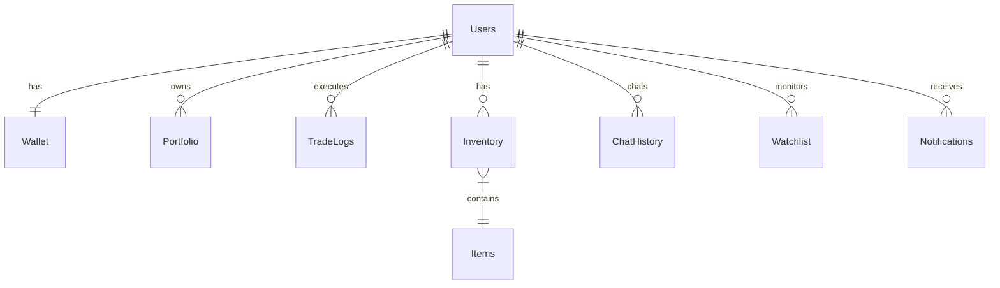

# 📁 MadCamp02: 최종 통합 명세서

**Ver 2.7 - Complete Edition (Spec-Driven Alignment)**

---

## 📝 변경 이력

| 버전 | 날짜 | 변경 내용 | 작성자 |
|------|------|----------|--------|
| 1.0 | 2026-01-15 | 초기 명세서 작성 | MadCamp02 |
| 2.0 | 2026-01-16 | 프론트엔드/백엔드 통합 명세 완성 | MadCamp02 |
| 2.1 | 2026-01-17 | Exception 구조 정리, ErrorResponse DTO 추가 | MadCamp02 |
| 2.2 | 2026-01-17 | 카카오 OAuth, 일반 회원가입/로그인 추가 | MadCamp02 |
| 2.3 | 2026-01-17 | OAuth2 백엔드 주도 방식으로 변경 | MadCamp02 |
| 2.4 | 2026-01-17 | 프론트엔드 현재 구현 상태 분석 및 누락 항목 정리 | MadCamp02 |
| 2.5 | 2026-01-18 | 실제 구현된 프론트엔드 페이지(Market, Shop, Trade) 명세 공식화 | MadCamp02 |
| **2.6** | **2026-01-18** | **하이브리드 인증 아키텍처(Frontend/Backend Driven) 반영** | **MadCamp02** |
| **2.7** | **2026-01-18** | **정합성 기준 고정 및 엔드포인트/용어 문구 정리(라우트/실시간/인증)** | **MadCamp02** |

### Ver 2.6 주요 변경 사항

1.  **인증 아키텍처 유연화**: 다양한 클라이언트(Web, Mobile App) 지원을 위해 **하이브리드 인증 방식**을 공식 채택했습니다.
    *   **Web**: 보안성이 높은 Backend-Driven (Redirect) 방식 권장.
    *   **App/SPA**: 사용자 경험이 매끄러운 Frontend-Driven (Token API) 방식 지원.

### Ver 2.7 주요 변경 사항

1.  **정합성 기준(Single Source of Truth) 고정**: 본 문서와 개발 계획서(`FRONTEND_DEVELOPMENT_PLAN`, `BACKEND_DEVELOPMENT_PLAN`)를 기준으로 구현을 동기화.
2.  **Frontend 구현 현황 표현 정리**: “실제 구현 반영”이라고 단정된 항목 중, 현 시점 코드와 불일치하는 라우트/실시간/인증 표현을 **구현 예정(Phase 1~3)**으로 정리.

---

## 📋 목차

1. [프로젝트 개요](#1-프로젝트-개요)
2. [시스템 아키텍처](#2-시스템-아키텍처)
3. [기술 스택](#3-기술-스택)
4. [데이터베이스 설계](#4-데이터베이스-설계)
5. [API 명세](#5-api-명세)
6. [프론트엔드 구조](#6-프론트엔드-구조)
7. [핵심 기능 상세](#7-핵심-기능-상세)
8. [게이미피케이션 시스템](#8-게이미피케이션-시스템)
9. [AI 시스템](#9-ai-시스템)
10. [실시간 통신](#10-실시간-통신)
11. [보안 및 인증](#11-보안-및-인증)
12. [배포 전략](#12-배포-전략)

---

## 1. 프로젝트 개요

### 1.1 프로젝트 정보

| 항목 | 내용 |
|------|------|
| **프로젝트명** | MadCamp02 |
| **슬로건** | "차트는 운명을 말하고, 수익은 아바타를 춤추게 한다." |
| **버전** | 2.0 |
| **타겟 플랫폼** | Web (Desktop 우선, 모바일 반응형) |

### 1.2 프로젝트 정의

Finnhub 실시간 주가 데이터를 기반으로, **사용자의 투자 성과와 사주(Saju)가 결합되어 아바타와 상호작용**하는 RPG형 웹 모의투자 플랫폼.

### 1.3 핵심 차별점

1. **Narrative (서사):** 딱딱한 주식을 '운세'와 '캐릭터'로 풀어냄
2. **Gamification (게임화):** 투자 수익 → 게임 코인 → 가챠 → 아바타 커스터마이징
3. **Tech (기술):** RDBMS의 안정성 + Redis의 속도 + Gen-AI의 창의성을 결합한 하이브리드 아키텍처
4. **Personalization (개인화):** 사주/별자리 기반 맞춤형 투자 조언

---

## 2. 시스템 아키텍처

### 2.1 전체 구조도

```
┌─────────────────────────────────────────────────────────────────┐
│                        CLIENT LAYER                              │
│  ┌─────────────────────────────────────────────────────────────┐ │
│  │  React (Next.js 16) + TypeScript + Tailwind CSS             │ │
│  │  ├── Zustand (상태 관리)                                     │ │
│  │  ├── STOMP.js (WebSocket)                                   │ │
│  │  ├── Lightweight Charts (캔들 차트)                          │ │
│  │  └── Shadcn/UI (컴포넌트)                                    │ │
│  └─────────────────────────────────────────────────────────────┘ │
└─────────────────────────────────────────────────────────────────┘
                              │
                    HTTPS / WSS (TLS 1.3)
                              │
                              ▼
┌─────────────────────────────────────────────────────────────────┐
│                    APPLICATION LAYER                             │
│  ┌──────────────────────┐    ┌──────────────────────┐           │
│  │  Spring Boot 3.2     │    │  FastAPI (Python)    │           │
│  │  (Core Server)       │◄───│  (AI Server)         │           │
│  │  ├── REST API        │    │  ├── LLM Inference   │           │
│  │  ├── WebSocket       │    │  ├── Stable Diffusion│           │
│  │  ├── OAuth2 (Hybrid) │    │  └── SSE Streaming   │           │
│  │  └── Transaction     │    └──────────────────────┘           │
│  └──────────────────────┘                                        │
└─────────────────────────────────────────────────────────────────┘
                              │
                              ▼
┌─────────────────────────────────────────────────────────────────┐
│                       DATA LAYER                                 │
│  ┌──────────────────┐  ┌──────────────────┐  ┌────────────────┐ │
│  │  PostgreSQL 16   │  │  Redis 7         │  │  Finnhub API   │ │
│  │  (Main DB)       │  │  (Cache/Pub-Sub) │  │  (Market Data) │ │
│  │  ├── Users       │  │  ├── Session     │  │  ├── WebSocket │ │
│  │  ├── Wallet      │  │  ├── Portfolio   │  │  └── REST API  │ │
│  │  ├── Trade Logs  │  │  ├── Ranking     │  └────────────────┘ │
│  │  ├── Chat History│  │  └── Pub/Sub     │                     │
│  │  ├── Items       │  └──────────────────┘                     │
│  └──────────────────┘                                            │
└─────────────────────────────────────────────────────────────────┘
```

*   **WebSocket (STOMP) Endpoint**: `/ws-stomp`
*   **Oracle SSE Endpoint**: `POST /chat/ask`

---

## 3. 기술 스택

### 3.1 Frontend

| 기술 | 버전 | 용도 |
|------|------|------|
| Next.js | 16.x | React 프레임워크 (App Router) |
| React | 19.x | UI 라이브러리 |
| TypeScript | 5.x | 타입 안전성 |
| Tailwind CSS | 3.4.x | 스타일링 |
| Zustand | 5.x | 전역 상태 관리 |
| @stomp/stompjs | 7.x | WebSocket 클라이언트 |
| lightweight-charts | 5.x | 캔들 차트 |
| Axios | 1.x | HTTP 클라이언트 |
| next-auth | 5.x | 인증 (Credentials/OAuth Wrapper) |

### 3.2 Backend (Core)

| 기술 | 버전 | 용도 |
|------|------|------|
| Java | 21 LTS | 언어 |
| Spring Boot | 3.2.x | 프레임워크 |
| Spring Security | 6.x | 인증/인가 (OAuth2 Client) |
| Spring Data JPA | 3.x | ORM |
| Spring WebSocket | 6.x | 실시간 통신 (STOMP) |

### 3.3 Backend (AI)

| 기술 | 버전 | 용도 |
|------|------|------|
| Python | 3.11+ | 언어 |
| FastAPI | 0.100+ | API 서버 |
| PyTorch | 2.x | AI 프레임워크 |
| Transformers | Latest | LLM |

---

## 4. 데이터베이스 설계

### 4.1 ERD 요약



### 4.2 테이블 DDL

#### users (사용자)

```sql
CREATE TABLE users (
    user_id BIGSERIAL PRIMARY KEY,
    email VARCHAR(255) NOT NULL UNIQUE,
    password VARCHAR(255),             -- 일반 회원용 (BCrypt)
    nickname VARCHAR(50) NOT NULL,
    provider VARCHAR(20) DEFAULT 'LOCAL', -- LOCAL, GOOGLE, KAKAO
    birth_date DATE,                   -- 온보딩 입력
    saju_element VARCHAR(10),          -- FIRE, WATER, WOOD, GOLD, EARTH
    zodiac_sign VARCHAR(20),           -- 띠
    avatar_url TEXT,
    is_public BOOLEAN DEFAULT TRUE,    -- 🆕 프로필 공개 여부
    is_ranking_joined BOOLEAN DEFAULT TRUE, -- 🆕 랭킹 참여 여부
    created_at TIMESTAMP DEFAULT CURRENT_TIMESTAMP,
    updated_at TIMESTAMP DEFAULT CURRENT_TIMESTAMP
);
```

#### items (아이템 마스터)

```sql
CREATE TABLE items (
    item_id BIGSERIAL PRIMARY KEY,
    name VARCHAR(100) NOT NULL,
    description TEXT,
    category VARCHAR(20) NOT NULL,        -- 🆕 NAMEPLATE, AVATAR, THEME
    rarity VARCHAR(20) NOT NULL,          -- COMMON, RARE, EPIC, LEGENDARY
    probability FLOAT NOT NULL,           -- 확률 (0.0~1.0)
    image_url TEXT,
    created_at TIMESTAMP DEFAULT CURRENT_TIMESTAMP
);
```

*(나머지 테이블 `wallet`, `portfolio`, `trade_logs`, `inventory`, `watchlist`, `chat_history`, `notifications`는 Ver 2.4와 동일)*

---

## 5. API 명세

### 5.1 인증 API (`/api/v1/auth`)

| Method | Endpoint | 설명 |
|--------|----------|------|
| POST | `/signup` | 일반 회원가입 |
| POST | `/login` | 일반 로그인 |
| POST | `/logout` | 로그아웃 |
| POST | `/refresh` | 토큰 갱신 |
| GET | `/me` | 현재 사용자 정보 (보안) |
| POST | `/oauth/kakao` | **Frontend-Driven** Kakao 로그인 (Body: accessToken) |
| POST | `/oauth/google` | **Frontend-Driven** Google 로그인 (Body: idToken) |

### 5.2 사용자 API (`/api/v1/user`)

| Method | Endpoint | 설명 |
|--------|----------|------|
| GET | `/me` | 내 프로필 상세 조회 |
| PUT | `/me` | 프로필/설정 수정 (닉네임, 공개여부 등) |
| POST | `/onboarding` | 온보딩 (생년월일 입력 및 사주 계산) |
| GET | `/wallet` | 지갑 정보 (예수금, 코인 등) |

### 5.3 시장/주식 API (`/api/v1/market`, `/api/v1/stock`) 🆕

| Method | Endpoint | 설명 |
|--------|----------|------|
| GET | `/market/indices` | 주요 시장 지수 (KOSPI, S&P500 등) 조회 |
| GET | `/market/news` | 최신 시장 뉴스 조회 |
| GET | `/market/movers` | 급등/급락/거래량 상위 종목 조회 |
| GET | `/stock/search` | 종목 검색 (Query: keyword) |
| GET | `/stock/quote/{ticker}` | 특정 종목 현재가/호가 조회 |
| GET | `/stock/candles/{ticker}` | 캔들 차트 데이터 조회 |

### 5.4 거래 API (`/api/v1/trade`)

| Method | Endpoint | 설명 |
|--------|----------|------|
| GET | `/available-balance` | 매수 가능 금액 조회 |
| POST | `/order` | 매수/매도 주문 실행 |
| GET | `/portfolio` | 보유 종목 및 수익률 조회 |
| GET | `/history` | 거래 내역 조회 |

### 5.5 상점/게임 API (`/api/v1/game`) 🆕

| Method | Endpoint | 설명 |
|--------|----------|------|
| GET | `/items` | 상점 아이템 목록 (Query: category) |
| POST | `/gacha` | 가챠 뽑기 실행 (코인 차감) |
| GET | `/inventory` | 내 인벤토리 조회 |
| PUT | `/equip/{itemId}` | 아이템 장착/해제 토글 |
| GET | `/ranking` | 유저 랭킹 조회 |

---

## 6. 프론트엔드 구조

### 6.1 디렉토리 구조 (목표 구조 / 구현 현황 포함)

```
src/
├── app/
│   ├── (main)/                  # 메인 레이아웃 (Sidebar + Chatbot)
│   │   ├── page.tsx             # 대시보드
│   │   ├── market/page.tsx      # 🆕 시장/뉴스
│   │   ├── trade/page.tsx       # 🆕 거래
│   │   ├── portfolio/page.tsx   # 🆕 포트폴리오
│   │   ├── shop/page.tsx        # 🆕 가챠 샵
│   │   ├── ranking/page.tsx     # 랭킹
│   │   ├── oracle/page.tsx      # AI 도사
│   │   ├── calculator/page.tsx  # 🆕 계산기 (구현 예정: Phase 1 정합성 작업)
│   │   └── mypage/page.tsx      # 마이페이지
│   ├── login/page.tsx           # 로그인
│   ├── onboarding/page.tsx      # 온보딩
│   ├── signup/page.tsx          # 🆕 회원가입 (구현 예정: Phase 1 정합성 작업)
│   ├── oauth/callback/page.tsx  # 🆕 OAuth Callback (구현 예정: Phase 1 정합성 작업)
│   └── ...
├── components/
│   ├── dashboard/               # 대시보드 위젯 (Chart, Order, Watchlist...)
│   ├── layout/                  # Sidebar, Header, Chatbot
│   ├── news/                    # Market 관련 컴포넌트 (현 구현: `news/`, 정합성 목표: `market/`로 정리)
│   ├── trade/                   # 🆕 Trade 관련 컴포넌트
│   ├── gacha/                   # 🆕 Shop/Gacha 컴포넌트
│   └── ...
├── stores/                      # Zustand Stores
│   ├── auth-store.ts
│   ├── stock-store.ts
│   ├── ui-store.ts
│   └── user-store.ts
└── lib/
    ├── api/                     # API 클라이언트 모듈
    └── saju-calculator.ts       # 사주 로직
```

### 6.2 주요 페이지 명세

1.  **대시보드 (`/`)**: 위젯 형태의 요약 정보 (자산 추이, 관심 종목, 간단 랭킹).
2.  **시장 (`/market`)**: KOSPI/NASDAQ 등 지수, 급등/급락 종목, 뉴스 피드.
3.  **거래 (`/trade`)**: 실시간 호가창, 차트, 매수/매도 주문 패널.
4.  **포트폴리오 (`/portfolio`)**: 보유 종목 상세 분석, 비중 차트, 거래 내역.
5.  **상점 (`/shop`)**: 가챠 머신 UI, 아이템 뽑기, 획득 확률 정보.
6.  **AI 도사 (`/oracle`)**: LLM 기반 투자 상담 채팅, 사주/운세 정보.
7.  **마이페이지 (`/mypage`)**: 아바타 꾸미기, 인벤토리 관리, 사용자 설정.

---

## 7. 인증 및 보안

### 7.1 인증 흐름 (Hybrid OAuth2)

MadCamp02는 유연한 연동을 위해 두 가지 인증 흐름을 모두 제공합니다.

#### A. Backend-Driven (Web Standard)
1.  **로그인 요청**: 프론트엔드에서 `GET {BACKEND_URL}/oauth2/authorization/kakao`로 리다이렉트.
2.  **인증 처리**: 백엔드에서 소셜 인증 후 JWT 생성.
3.  **토큰 전달**: 백엔드가 프론트엔드의 `/oauth/callback`으로 리다이렉트하며 Query Parameter로 토큰 전달. *(프론트 라우트 구현: Phase 1)*
    *   예: `http://localhost:3000/oauth/callback?accessToken=...&isNewUser=true`
4.  **세션 저장**: 프론트엔드에서 토큰 추출 후 스토리지 저장 및 `auth-store` 업데이트.

#### B. Frontend-Driven (Mobile/SPA)
1.  **토큰 획득**: 프론트엔드(앱)에서 카카오 SDK 등을 통해 Access Token 직접 획득.
2.  **로그인 요청**: 프론트엔드가 `POST /api/v1/auth/oauth/kakao` 호출 (Body: `{ "accessToken": "..." }`).
3.  **토큰 발급**: 백엔드 검증 후 JWT 응답.

---

**문서 버전:** 2.7 (Spec-Driven Alignment)
**최종 수정일:** 2026-01-18
